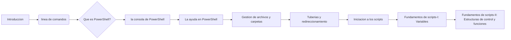
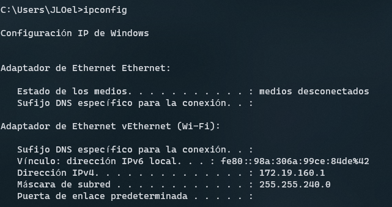
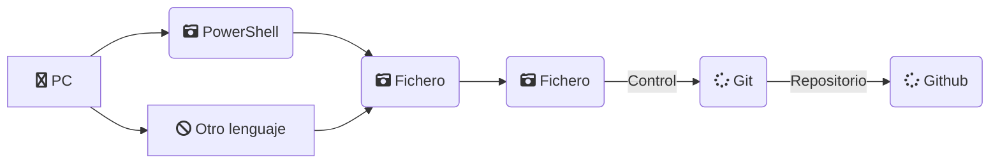
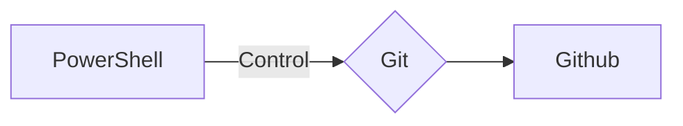

# PRIMERA ECTS DE FC💻
<h2>PowerShell y el uso de Git en Github</h2>
[](#PowerShell)
[](#Github)
[](#Github)

 <br>
 <br>


Desarrollado por José Luis Obiang Ela Nanguan\


Puedes obtener toda la documentación aquí [JLOEN1999](https://github.com/Jloen1999/PrimeraECTSFC)

<h1><b>Índice de contenido</b></h1>

1. <strong><a href="#Presentación">Presentación</a></strong><br>
1.1. <strong><a href="#Objetivos">Objetivos</a></strong>
2. <strong><a href="#PowerShell">PowerShell</a></strong><br>
   2.1 <strong><a href="#Introducción">Introducción</a></strong><br>
   2.2. <a href="#Comandos">___La línea de comandos___</a><br>
   2.3. <a href="#Significado">___¿Qué es PowerShell?___</a><br>
   2.4. <a href="#Consola">___Abrir la consola de PowerShell___</a><br>
   2.5. <a href="#Ayuda">___La ayuda en PowerShell___</a><br>
   2.6. <a href="#Archivos">___Gestión de archivos y carpetas___</a><br>
   2.7. <a href="#Tuberias">___Tuberías y redireccionamiento___</a><br>
   2.8. <a href="#Scripts">___Iniciación a los scripts___</a><br>
   2.9. <a href="#F1">___Fundamentos de scripts-I: Variables___</a><br>
   2.10. <a href="#F2">___Fundamentos de scripts-II: Estructuras de control y funciones___</a>
3. <strong><a href="#Github">Github</a></strong><br>


<h3 style="color:magenta"><u>1. Presentación</u></h3>
<p id="Presentación">
Este curso está planteado en lo más práctico posible. Las Prácticas que vamos a realizar son las siguientes:

___En el primer momento empezaremos a trabajar con la PowerShell y la PowerShell ISE___

___Vamos a buscar Información___

 ___Vamos a utilizar los comandos básicos relacionados con la gestión de archivos y carpetas___

___Vamos a enlazar la salida de un comando con la entrada de otro y redireccionar la salida___

___Y Vamos a realizar pequeños scripts y hablando de Scrips, vamos a hacer un script en el que combinaremos esctructuras condicionales, repetitivas y redireccionamiento.___

__También haremos uso de la herramienta Git que es un sistema de control de versiones desarrollado por Linux Torvalds en el año 2005 y que se ha hecho muy popular gracias a servicios como Github.__\
Si eres programador, desarrollador web, administrador de sistemas, diseñador, ... es muy probable que en algún momento de tu trabajo te encuentres con un proyecto en el que tengas que colaborar con otras personas usando Git. Puede que trabajes solo pero que te interese tener un seguimiento y control de tu trabajo. Es estos dos casos y en muchos más un conocimiento más o menos profundo de Git te permitirá ser mucho más productivo en tu trabajo y, sobre todo, evitar muchos problemas con los que se encuentra a menudo la gente que no trabaja con un sistema de control de versiones.
> > Si tu ámbito de trabajo es técnico y aún no usas Git, cuando lleves unos meses usándolo te preguntarás cómo es posible que no lo hubieras empezado a usar antes.

<h3 style="color:green; margin-left: 30px">1.1. Objetivos</h3>

***¿Qué vamos a conseguir al finalizar este curso?***

Pues vamos a:

<table style="border: 1px solid">
<tr>
<th><strong>A manejar tanto la PowerShell como la PowerShell ISE con soltura.</strong></th>
<th><strong>Buscar información en la ayuda de PowerShell.</strong></th>
<th><strong>Conocer los comandos básicos.</strong></th>
<th><strong>Ser capaces de realizar scripts para automatizar determinadas tareas.</strong></th>
<th><strong>Conocer los comandos básicos de Git para hacer un buen seguimiento de nuestros proyectos en Github.</strong></th>
</tr>
</table>

<h3 style="color:magenta"><u>2. PowerShell</u></h3>

<p style="color:green; margin-left: 30px" id="Introducción"><strong style="font-size: 18px">2.1. Introducción</strong>

> La interfaz de usuario es el medio que utilizamos para comunicarnos con el ordenador.

> Interfaz gráfica: GUI(Proporciona un entorno visual)

> Interfaz de línea de comandos:CLI(Command Line Interface, nos permite dar instrucciones por medio de una línea de texto)

**¿Cuál de las dos debemos utilizar?**

> La respuesta es fácil, depende de lo que queramos hacer, si quieres navegar, trabajar con un procesador de texto, hoja de cálculo, retocar fotografía, etc, tu respuesta es la interfaz gráfica.
> Y si lo que quieres es automatizar tareas, crear usuarios de forma masiva, comprobar conectividad con servidores pues la respuesta es PowerShell(La linea de comandos)

</p>   
<p style="color:green" id="Comandos"><strong style="font-size: 18px;margin-left: 30px">2.2. La línea de comandos</strong>

Vamos a ver ahora cómo ha evolucionado la línea de comandos de Windows

___CMD o símbolo del sistema:___

Todavía convive con nosotros pero cada vez se utiliza menos, tal vez para hacer un ping o ipconfig
```cmd
ping 8.8.8.8 (Para comprobar si nuestra PC tiene conexión a Internet)
```


```cmd
ipconfig (Para ver los adaptadores de red de la PC)
```


___PowerShell___

En cambio la PowerShell se pensó como una herramienta de reemplazo del CMD y con el tiempo se ha convertido en una herramienta poderosa de gestión tanto para usuarios domésticos como administradores

</p>
<p style="color:green" id="Significado"><strong style="font-size: 18px;margin-left: 30px">2.3. ¿Qué es PowerShell?</strong>


</p>

<p id="PowerShell">La PowerShell es una nueva línea de comandos, es decir, es una herramienta multiplataforma utilizada principalmente por los administradores de Sistemas Windows para automatizar tareas y tener un mayor control del sistema.
Esta herramienta está formada por una shell de comandos, un lenguaje de scripting y un marco de administración de configuración.
Trabaja con objetos, acepta y devuelve objetos en vez de texto como ocurre con el CMD 

***¿Dónde podemos encontrar PowerShell?*** En Windows 10 la encontramos, Windows Server, Microsoft Azure, SQL Server, Sercivios de Office 365, se encuentra prácticamente en todos los productos de Microsoft

<table>
    <thead>
        <tr>
           <th colspan="2">Versiones</th>   
        </tr>
    </thead>
    <tbody>
        <tr>
            <th>Versión</th>
            <th>año</th>
        </tr>
        <tr>
            <th>V1</th>
            <th>2006</th>
        </tr>
        <tr>
            <th>V2</th>
            <th>2009</th>
        </tr>
        <tr>
            <th>V3</th>
            <th>2012</th>
        </tr>
        <tr>
            <th>V4</th>
            <th>2013</th>
        </tr>
        <tr>
            <th>V5</th>
            <th>2016</th>
        </tr>
        <tr>
            <th>V5.1</th>
            <th>2017</th>
        </tr>
        <tr>
            <th>V Core 6.0</th>
            <th>2018</th>
        </tr>
    </tbody>
</table>

No tenemos que confundir:
* Windows PowerShell ISE, es un entorno en el que podemos ejecutar comandos, escribir, probar y depurar script.
* Windows PowerShell es la consola de comandos.

***¿Qué requisitos se necesitan para aprender dicha herramienta?***
Como se trata de un curso a nivel de iniciación en PowerShell, cualquier persona con conocimientos de informática a nivel de usuario podría hacerlo sin mayor problema, ahora bien hay una parte en la que se habla de variables y estructuras condicionales y entonces aquí si se requiere conocimientos mínimos de programación.

***¿Qué máquina necesitamos para trabajar en PowerShell?***
Es suficiente con tener un Windows 10 instalado o bien un Windows Server


<p style="color:green;font-size: 18px; margin-left: 18px" id="Consola"><strong>2.4. Abrir la consola de PowerShell</strong></p>
Hay varias maneras de abrir la consola de comandos en Windows:

* Dando click derecho sobre el símbolo de Windows y pinchamos donde aparece PowerShell
* Pulsando Windows+R y escribimos `PowerShell`

Podemos ver la versión que tiene nuestro PowerShell con el comando `get-host`


<p id="#Ayuda" style="color: green;margin-left: 30px;font-size: 18px"><strong>2.4. La ayuda en PowerShell</strong>

La ayuda en PowerShell es muy completa y trae muchos ejemplos, necesitamos acceso a internet para descargarla, eso puede parecer una limitación pero nos permite tener una ayuda actualizada.
Para actualizar la ayuda de PowerShell necesitamos el comando `update-help` y eso para tener actualizada las últimas novedades, la ayuda de PowerShell nos da muchos ejemplos del uso de cada comando


**Concepto de cmdlet**:\
En verdad en PowerShell se habla de cmdlet(commandlet). Es una combinación de verbo y nombre separados por un guión `(-)`.\
___Verbo:___ describe la acción que se va a realizar
___nombre___ es el objeto sobre el que se va a realizar la acción.\
Para entender mejor ahora abrimos nuestra consola:
* Ejemplos de Verbos: `get`(Obtiene una información) `set`(Cambia una propiedad) `remove`(Elimina un objeto) `new`(Crea un objeto) pero estos verbos no hacen nada si no les aplicamos un nombre


* Ejemplos de Nombres: `localuser` `localgroup` `netadapter` `partition`, estos nombres tampoco hacen algo si no les aplicamos un verbo


Vamos a combinarlos a ver si ahora conseguimos algo.\
<span style="color: blue">Ejemplos: </span>\
`Get-localuser`(Muestra todos los usuarios locales del sistema).\

<span style="color:red">NOTA: Una cosa, PowerShell no es sensible a las mayúsculas ni minúsculas, es decir, puedes poner un comando todo mayúsculas o minúsculas o puedes acceder a un archivo de igual manera</span>\
`get-date`(Para saber la fecha actual del sistema)


`clear`(Para limpiar la pantalla)4


</p>

<h3 style="color:magenta">3. Git en Github</h3>



<p id="Github">Lorem ipsum dolor sit amet, consectetur adipisicing elit. Eaque esse harum modi omnis veritatis. Accusantium, architecto, aspernatur assumenda blanditiis commodi cum cumque cupiditate dignissimos dolore enim facere fugit harum incidunt maiores maxime minima modi natus nostrum nulla numquam, quasi ratione repellat sint totam velit voluptas voluptate voluptates! Ab asperiores at cupiditate dicta dolore dolorem dolores dolorum ea, eaque earum, error est hic, illum ipsa magni maxime minus nesciunt nostrum odit officia quae quam quas quidem quis quo reprehenderit tempora tempore. Animi corporis ea eligendi hic mollitia, nulla!</p>


