# PRIMERA ECTS DE FC 💻

<h2>PowerShell y el uso de Git en Github</h2><br>

[](#PowerShell)
[](#Github)
[](#Github)

 <br>
 <br>


***Desarrollado por José Luis Obiang Ela Nanguan***

***Documentación del proyecto:*** :point_right:[JLOEN1999](https://github.com/Jloen1999/PrimeraECTSFC)

***Documentación oficial de PowerShell:*** :point_right:[PowerShell](https://docs.microsoft.com/es-es/powershell/scripting/overview?view=powershell-7.2)


<h1><b>Índice de contenido</b></h1>

**1.** <strong><a id="1" href="#Presentación">Presentación</a></strong><br>
<strong style="margin-left: 24px">1.1. <a id="2" href="#Objetivos">Objetivos</a></strong><br>
**2.** <strong><a id="3" href="#PowerShell">PowerShell</a></strong><br>
<strong style="margin-left: 24px">2.1. <a id="4" href="#Introducción">Introducción</a><br>
<strong style="margin-left: 24px">2.2. <a id="5" href="#Comandos">El paso de CMD a PowerShell</a><br>
<strong style="margin-left: 24px">2.3. <a id="6" href="#Significado">¿Qué es PowerShell?</a><br>
<strong style="margin-left: 24px">2.4. <a id="7" href="#Consola">La consola de PowerShell</a><br>
<strong style="margin-left: 24px">2.5. <a id="8" href="#Ayuda">La ayuda en PowerShell</a><br>
<strong style="margin-left: 48px">2.5.1. <a id="9" href="#module">Obtener Comandos con get-command y get-module</a></strong><br>
<strong style="margin-left: 48px">2.5.2. <a id="10" href="#help">Obtener ejemplos del uso de Comandos con get-help</a></strong><br>
<strong style="margin-left: 48px">2.5.3. <a id="11" href="#atajoAlias">Atajos y Alias</a></strong><br>
<strong style="margin-left: 24px">2.6. <a id="12" href="#Archivos">Gestión de archivos y carpetas</a><br>
<strong style="margin-left: 24px">2.7. <a id="13" href="#Tuberias">Tuberías y redireccionamiento</a><br>
<strong style="margin-left: 24px">2.8. <a id="14" href="#Scripts">Iniciación a los scripts</a><br>
<strong style="margin-left: 24px">2.9. <a id="15" href="#F1">Fundamentos de scripts-I: Variables</a><br>
<strong style="margin-left: 24px">2.10. <a id="16" href="#F2">Fundamentos de scripts-II: Estructuras de control y funciones</a><br>
**3.** <strong><a id="17" href="#Github">Github</a></strong><br><br>

<strong><a style="color:magenta; font-size:25px; margin:0px" href="#1">1. Presentación</a></strong><br>

<p id="Presentación">
Este curso está planteado en lo más práctico posible. Las Prácticas que vamos a realizar son las siguientes:

___En primer lugar empezaremos a trabajar con la PowerShell y la PowerShell ISE___.

___Vamos a buscar Información sobre el uso de algunos comandos___.

___Vamos a utilizar los comandos básicos relacionados con la gestión de archivos y carpetas___.

___Vamos a enlazar la salida de un comando con la entrada de otro y redireccionar la salida___.

___Y vamos a realizar pequeños scripts, vamos a hacer scripts en los que combinaremos esctructuras condicionales, repetitivas y redireccionamiento.___

___También haremos uso de la herramienta Git y la subida de nuestros scripts a Github___

</p>
<strong style="margin-left: 25px"><a style="color:green; font-size:25px" href="#2">1.1. Objetivos</a></strong><br>

<p id="Objetivos"></p>

***¿Qué vamos a conseguir al finalizar este curso?***

Pues vamos a:

<table style="border: 1px solid">
<tr>
<th><strong>A manejar tanto la PowerShell como la PowerShell ISE con soltura.</strong></th>
<th><strong>Buscar información en la ayuda de PowerShell.</strong></th>
<th><strong>Conocer los comandos básicos.</strong></th>
<th><strong>Ser capaces de realizar scripts para automatizar determinadas tareas.</strong></th>
<th><strong>Conocer los comandos básicos de Git para hacer un buen seguimiento de nuestros proyectos en Github.</strong></th>
</tr>
</table>

<h3 style="color:magenta"><u></u></h3>

<strong><a style="color:magenta; font-size:25px; margin:0px" href="#3">2. PowerShell</a></strong><br>

<p id="PowerShell">

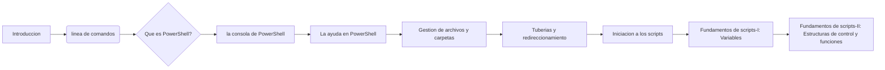

<strong style="margin-left: 25px"><a style="color:green; font-size:20px" href="#3">2.1. Introducción</a></strong><br>

<p id="Introducción">

> La interfaz de usuario es el medio que utilizamos para comunicarnos con el ordenador.

> Interfaz gráfica: GUI(Proporciona un entorno visual).

> Interfaz de línea de comandos: CLI(Command Line Interface, nos permite dar instrucciones por medio de una línea de texto).

**¿Cuál de las dos debemos utilizar?**

> La respuesta es fácil, depende de lo que queramos hacer, si quieres navegar, trabajar con un procesador de texto, hoja de cálculo, retocar fotografía, etc, tu respuesta es la interfaz gráfica
> , pero si lo que quieres es automatizar tareas, crear usuarios de forma masiva, comprobar conectividad con servidores pues la respuesta es PowerShell(La linea de comandos).

</p>   
<strong style="margin-left: 25px"><a style="color:green; font-size:25px" href="#5">2.2. El paso de CMD a PowerShell</a></strong><br>

<p id="Comandos">


Vamos a ver ahora cómo ha evolucionado la línea de comandos de Windows.

___CMD o símbolo del sistema:___

Todavía convive con nosotros, pero cada vez se utiliza menos, tal vez para hacer.

```cmd
ping (Para comprobar si nuestra PC está conectada a la red o para saber si una determinada página está caída)
```


```cmd
ipconfig (Para ver los adaptadores de red de la PC)
```

```cmd
msinfo32 (Para conocer información sobre nuestro sistema)
```

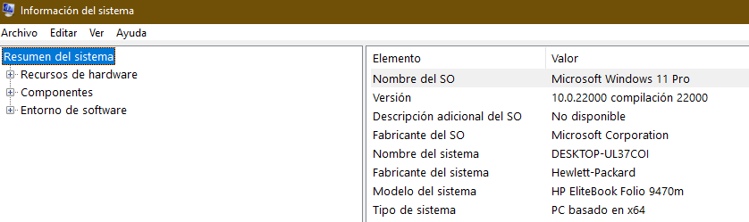

```
regedit (Que es una base de datos donde están los ajustes de configuración y opciones en los sistemas operativos Microsoft Windows.)
```

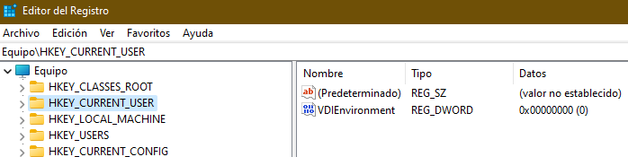

___PowerShell:___

En cambio, la PowerShell se pensó como una herramienta de reemplazo del CMD y con el tiempo se ha convertido en una herramienta poderosa de gestión tanto para usuarios domésticos como administradores.

</p>

<strong style="margin-left: 25px"><a style="color:green; font-size:20px" href="#6">2.3. ¿Qué es PowerShell?</a></strong><br>

<p id="Significado">

<p id="PowerShell">La PowerShell es una nueva línea de comandos, es decir, es una herramienta multiplataforma utilizada principalmente por los administradores de Sistemas Windows para automatizar tareas y tener un mayor control del sistema.
Esta herramienta está formada por una shell de comandos, un lenguaje de scripting y un marco de administración de configuración.
Trabaja con objetos, acepta y devuelve objetos y no acepta ni devuelve texto como lo hace CMD.
PowerShell fue desarrollado por Microsoft el 14 de noviembre de 2006 y está programado en C#.

***¿Dónde podemos encontrar PowerShell por defecto?*** En Windows 10 la encontramos, Windows Server, Microsoft Azure, SQL Server, Sercivios de Office 365, se encuentra prácticamente en todos los productos de Microsoft. Se puede instalar en Linux o MacOS.

<table>
    <thead>
        <tr>
           <th colspan="2">Versiones</th>   
        </tr>
    </thead>
    <tbody>
        <tr>
            <th>Versión</th>
            <th>año</th>
        </tr>
        <tr>
            <th>V1</th>
            <th>2006</th>
        </tr>
        <tr>
            <th>V2</th>
            <th>2009</th>
        </tr>
        <tr>
            <th>V3</th>
            <th>2012</th>
        </tr>
        <tr>
            <th>V4</th>
            <th>2013</th>
        </tr>
        <tr>
            <th>V5</th>
            <th>2016</th>
        </tr>
        <tr>
            <th>V5.1</th>
            <th>2017</th>
        </tr>
        <tr>
            <th>V Core 6.0</th>
            <th>2018</th>
        </tr>
        <tr>
            <th>Versión actual 7.2.2</th>
            <th>2022</th>
        </tr>
    </tbody>
</table>
No tenemos que confundir:

* Windows PowerShell ISE, es un entorno en el que podemos ejecutar comandos, escribir, probar y depurar script.
* Windows PowerShell es la consola de comandos.

***¿Qué requisitos se necesitan para aprender dicha herramienta?***
Como se trata de un curso en el ámbito de iniciación en PowerShell, cualquier persona con conocimientos de informática a nivel de usuario podría hacerlo sin mayor problema, ahora bien hay una parte en la que se habla de variables y estructuras condicionales y entonces aquí si se requiere conocimientos mínimos de programación.

***¿Qué máquina necesitamos para trabajar en PowerShell?***
Es suficiente con tener un Windows 10 instalado o bien un Windows Server.

<p id="Consola"><strong style="color:green;font-size: 25px; margin-left: 18px" ></strong><br>


<strong style="margin-left: 25px"><a style="color:green; font-size:20px" href="#7">2.4. La consola de PowerShell</a></strong><br>

<p id="Consola">

Hay varias maneras de abrir la consola de comandos en Windows:

* Dando clic derecho sobre el símbolo de Windows y pinchamos donde aparece PowerShell.
* Pulsando Windows+R y escribimos `PowerShell`.

Podemos ver la versión que tiene nuestro PowerShell con el comando `get-host`.

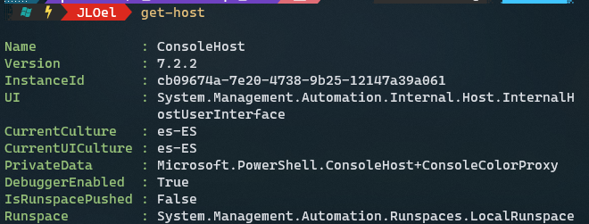

**Concepto de cmdlet**:
En verdad, en PowerShell se habla de cmdlet. Es una combinación de verbo y nombre separados por un guión`(-)`.
Verbo(Verb): describe la acción que se va a realizar.
Nombre(Noun) es el objeto sobre el que se va a realizar la acción.

<span style="color:red">NOTA: PowerShell incorpora incluso muchos de los comandos de Linux.</span>

Para entender mejor ahora abrimos la línea de Comandos PowerShell y si alguno tiene también alguna distribución Linux sea cual sea, podría abrirlo para hacer los ejemplos:

* Ejemplos de Verbos:
  * `get`(Obtiene una información)
  * `set`(Cambia una propiedad)
  * `remove`(Elimina un objeto)
  * `new`(Crea un objeto)

Pero estos verbos no hacen nada si no les aplicamos un nombre


* Ejemplos de Nombres:
  * `localuser`
  * `localgroup`
  * `netadapter`
  * `partition`
  * etc..

Pero estos nombres tampoco hacen algo si no les aplicamos un verbo.

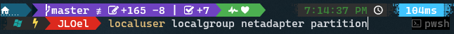

* Parámetros. Los comandos en PowerShell también tienen parámetros y podemos combinarlos:

  * _Path_ (Para especificar la ruta del directorio que puede absoluta o relativa)
  * _Force_ (Para mostrar también los archivos ocultos o para borrar un elemento de manera forzosa)
  * _Recurse_ (Para mostrar, copiar o mover absolutamente todos los archivos)
  * _Filter_ (Para hacer un filtro a la hora buscar información)
  * _Include_ (Hace lo mismo que Filter pero siempre va precedido del parámetro Recurse)
  * _Exclude_ () (Siempre va precedido del parémetro Recurse y sirve para mostrar solo los elementos que indicamos en el parámetro)
  * etc...
* Campos: La información suele mostrarse por campos, por lo tanto, también podríamos hacer un filtro de lo que queremos mostrar especificando el nombre del campo seguido del elemento a buscar.

Vamos a combinar los verbos y los nombres a ver si ahora conseguimos algo.<span style="color: blue">Ejemplos: </span>

* `Get-localuser`(Muestra todos los usuarios locales del sistema).

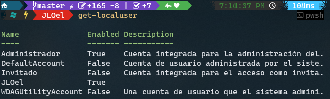

<span style="color:red">NOTA: Una cosa, PowerShell no es case sensitive, es decir, no distingue mayúsculas de minúsculas, es decir, puedes poner un comando con mayúsculas o minúsculas o puedes acceder a un archivo de igual manera</span>

* `get-date`(Para saber la fecha actual del sistema)

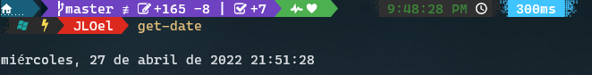

* `clear-host`(Para limpiar la pantalla)
* `get-location`(Para saber mi directorio actual)

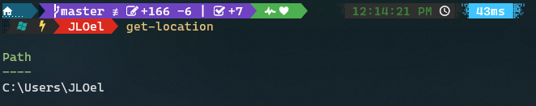

* `get-childItem`(Para ver los ficheros y carpetas que hay en nuestra ubicación actual o lo que especifiquemos nosotros)

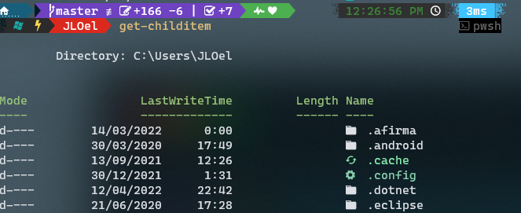

* `get-netadapter`(Para visualizar los adaptadores de red)

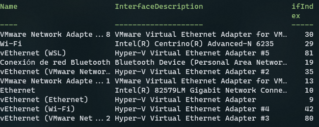

* `get-service`(Para ver cuáles son los procesos en segundo plano que se están ejecutando en nuestra máquina)


Por ejemplo si quisiéramos un servicio en concreto, podríamos hacerlo especificando el nombre del campo como parámetro y a continuación el nombre del servicio.

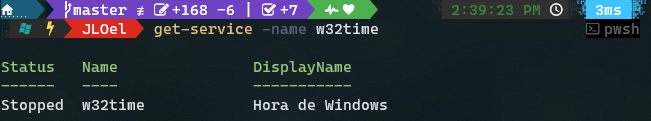

Digamos que estos son los comandos que conocemos. Entonces imaginaros que queremos usar un comando y no se cómo se escribe exactamente.

<strong style="color:green;font-size: 18px; margin-left: 18px"><a style="color: green" href="#8">2.5. La ayuda en PowerShell</a></strong><br>

<p id="Ayuda"></p>
<strong style="font-size: 18px; margin-left: 20px"><a style="color: yellow" href="#9">2.5.1. Obtener Comandos con get-command y get-module</a></strong><br>

<p id="module">Si yo pongo el comando `get-command` lo que conseguimos es visualizar todos los comandos que tiene la PowerShell.

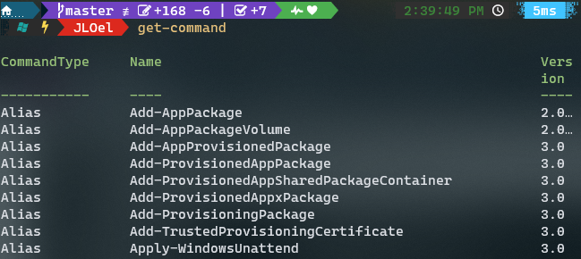

***Ejemplo:*** Estoy buscando un comando que tiene que ver con un verbo determinado

`get-command -verb new` (Busca aquellos comandos que tengan que ver con el verbo new)

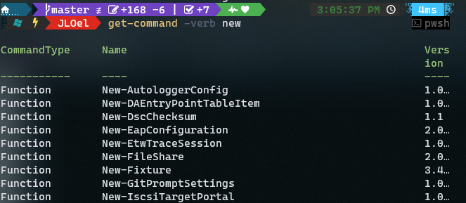

De igual manera podemos buscar los comandos que tienen que ver con un nombre en concreto

`get-command -noun localgroup` (Muestra aquellos comandos que tengan el nombre localgroup)


Y si quisiera buscar absolutamente todos los comandos que incluyan la palabra localgroup haríamos lo siguiente


Ahora vamos a ver el concepto de módulo

***Concepto de Módulo:*** Un módulo no es nada más que un conjunto de comandos

Para ver los módulos que hay en el sistema ejecutamos el siguiente comando
`get-module`

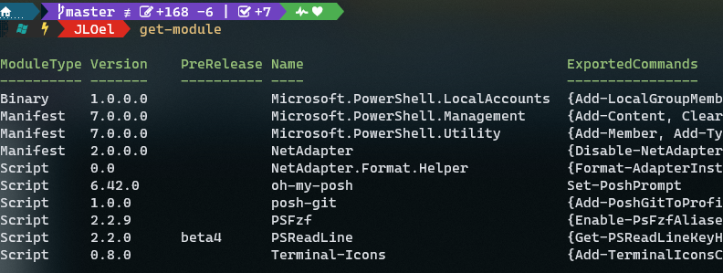

Si queremos ver los comandos que tiene un determinado módulo pondríamos

`get-command -module <nombre_modulo>`

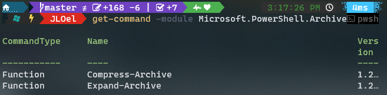

Si queremos saber cuáles son los módulos que se encuentran disponibles ejecutamos el comando

`get-module -ListAvailable`

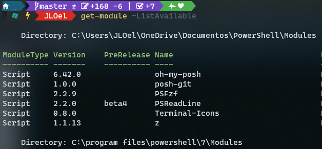

Digamos que queremos trabajar con los comandos del módulo BitLocker que no están en memoria, ejecutamos el comando

`import-module bitlocker`

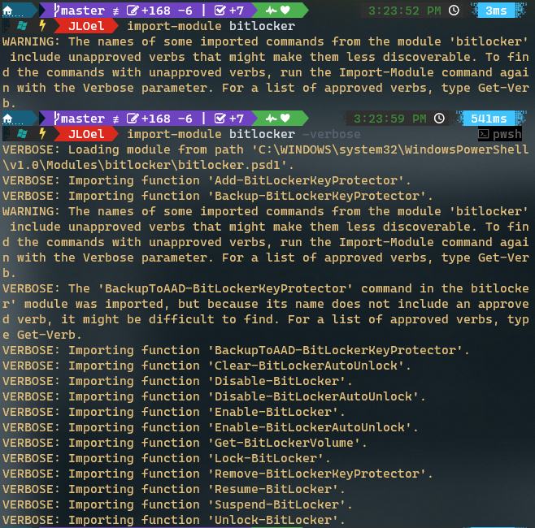

Ahora comprobamos que el módulo ha sido importado correctamente, ejecutamos nuevamente el comando
`get-module`

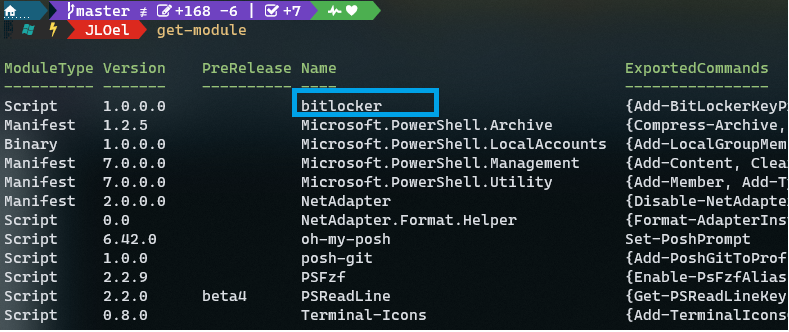

El módulo bitlocker ya está disponible en memoria, por lo tanto, ya podemos trabajar con sus comandos.
Si quisiéramos eliminar dicho módulo solo cambiamos el verbo `get` por `remove` y especificamos el nombre del módulo el cual queremos eliminar

`remove-module bitlocker`

Y comprobamos que ya no está con el comando `get-module`


</p>
<strong style="font-size: 18px; margin-left: 20px"><a style="color: yellow" href="#10">2.5.2. Obtener ejemplos del uso de Comandos con get-help</a></strong><br>
<p id="help">
¿Y ahora qué pasa si queremos buscar información e incluso ejemplos del uso de un comando?
Entonces necesitamos la ayuda de PowerShell.
La ayuda en PowerShell es muy completa y trae muchos ejemplos, necesitamos acceso a internet para descargarla, eso puede parecer una limitación pero nos permite tener una ayuda actualizada de los comandos.
Para actualizar la ayuda de PowerShell necesitamos el comando `update-help`, para tener incorporado las últimas novedades, la ayuda de PowerShell nos da muchos ejemplos del uso de cada comando.

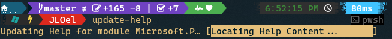

Existen tipos de ayuda en PowerShell:

- Ayuda estándar: `get-help <nombre_comando>`
- Ayuda con ejemplos: `get-help <nombre_comando> -examples`
- Ayuda con ejemplos y más detalles: `get-help <nombre_comando> -detailed`
- Ayuda Completa: `get-help <nombre_comando> -full`
- Ayuda Online: `get-help <nombre_comando> -online`

Vamos a verlo sobre la marcha, por ejemplo necesitamos crear la cuenta de un usuario pero no sabemos nada sobre la sintaxis de ese comando
Pues usamos lo siguiente. `get-help new-localuser`


Digamos que aun no me he enterado bien sobre el uso del comando, voy a hacer que me una ayuda a través de los ejemplos.

`get-help new-localuser -examples`

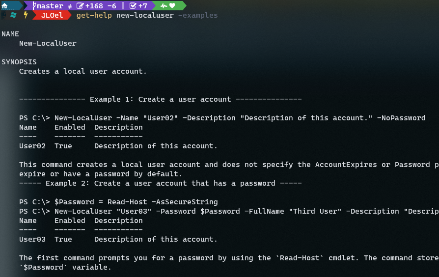

<span style="color:red">NOTA: Como crear o eliminar un usuario es una operación que necesita permiso de administrador tenemos que abrir nuestra PowerShell como administrador</span>

<strong style="font-size: 18px; margin-left: 35px"><a style="color: yellow" href="#10">2.5.3. Atajos y Alias</a></strong><br>

<p id="atajoAlias">

* ***Atajos:***
  La mayoría de los administradores quieren escribir los comandos lo más rápido posible, para ello usan los tabuladores.
  ¿Qué hace el tabulador? Nos completa el comando que estamos escribiendo, si hay más de una opción podemos verla con los cursores.
* ***Cursor:***
  Nos permite seleccionar un comando ejecutado anteriormente.
* ***Historial:***
  Otra función más interesante es el historial, entonces si yo digo dame el historial de todos los comandos que he ejecutado,
  usamos el comando `get-history`

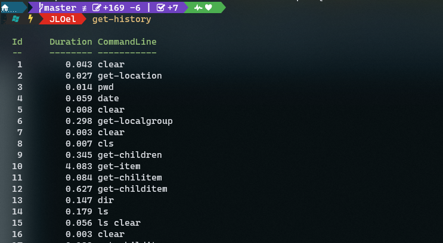

Por ejemplo si yo ejecuto `get-process` para saber todos los procesos que se están ejecutando ahora

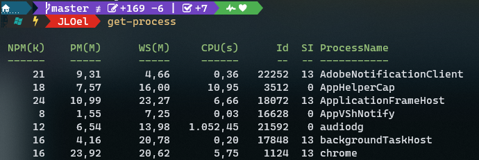

Vemos que sí se ha guardado en el historial


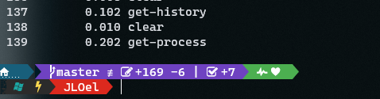

Si quisiéramos ejecutar por ejemplo el comando que está en el historial en la línea 2 lo hacemos con el comando
`invoke-history <posicion_historial>`

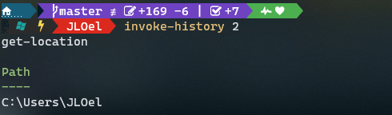

Pero veo que es escribir mucho, mirar con tan solo escribir `h` nos muestra el historial de comandos

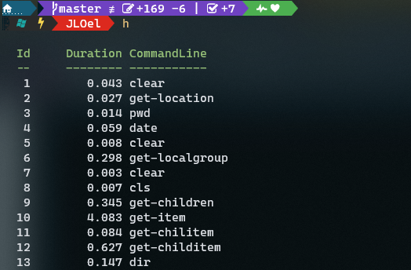

Por ejemplo si quiero ejecutar nuevamente el comando de la línea 2 del historial de comandos podría hacerlo solo con este comando

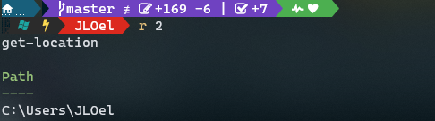

Es una forma muy abreviada y fácil de buscar y ejecutar comandos del historial.

Una utilidad que uso mucho es buscar un comando del historial con 

Por ejemplo si quisiera buscar un comando relacionado con `new`, y cada vez que pulso  me van apareciendo los comandos. Es una forma bastante fácil y util de buscar un comando en el historial de ayuda.

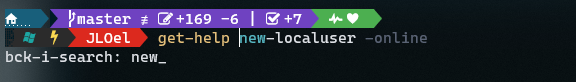

Si quisiéramos eliminar todo el historial de comandos usamos el comando `clear-history`

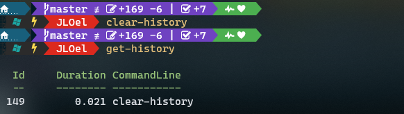

Tanto los historiales, los tabuladores y los cursores nos pueden ayudar a escribir los comandos de una forma más rápida.

* ***Alias:***
  El alias no es nada más que un apodo o un sobrenombre para referirse a un Cmdlet

Vamos a ver los alias que tiene el sistema con el comando `get-alias`

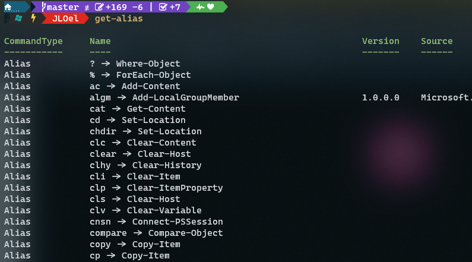

Como podemos observar muchos de los alias son iguales que los comandos que se usan la shell de Linux

Digamos que queremos saber si un comando tiene alias solo necesitamos este comando
`get-alias -Definition <Cmdlet>`

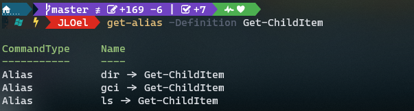

Voy a usar el que más se parece a Linux, el `ls`

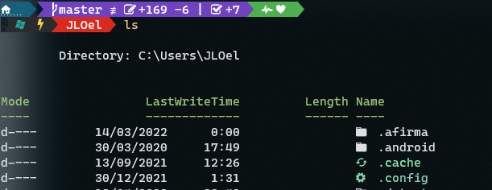

Y así existen un montón de alias.

Por ejemplo voy a crear un archivo y luego quisiera ver su contenido. Con el alias es bastante fácil
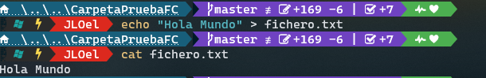

Pero sin Alias sería algo así:
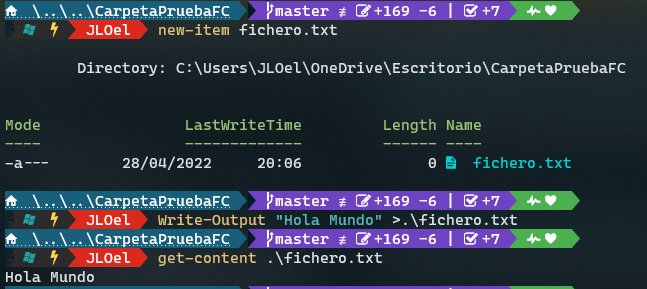

<strong style="margin-left: 25px"><a style="color:green; font-size:20px" href="#12">2.6. Gestión de archivos y carpetas</a></strong><br>

<p id="Archivos">

Ahora vamos a ver el tema de gestión de archivos y carpetas.

* Veremos los principales comandos para trabajar con archivos y carpetas.
* También vamos a hacer uso de los alias.

Existen 3 comandos fundamentales que son.

* ***`Get-Location`(pwd)***: nos devuelve la ruta o path en la que nos encontramos.
* ***`Set-Location`(cd)***: es para desplazarnos por la estructura de directorios.
* ***`Get-ChildItem`(ls)***: nos permite mostrar el contenido de un directorio.
  * Cuando mostramos el contenido de un directorio en el campo Mode nos aparecen unas letras
    * d: directorio
    * a: archivo
    * s: archivo del sistema
    * h: archivo oculto
    * r: lectura
    * w: escritura
    * x: ejecución


Digamos que queremos ver los archivos ocultos que hay en tu sistema, normalmente los archivos ocultos suelen estar en la raíz para que no puedan entrar los virus.

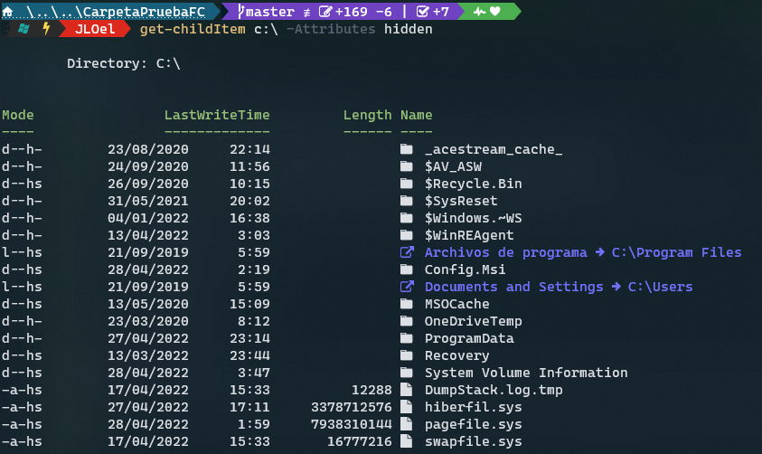

A algunos a lo mejor les aparezca el gestor de arranque de Windows bootmgr, el pagefile es donde están los archivos de paginación.

* ***`New-Item`:***
* Nos permite crear archivos y directorios
* Alias:
  * ni :arrow_right:Archivos
  * md :arrow_right:Directorios

Vamos a crear un archivo y un directorio
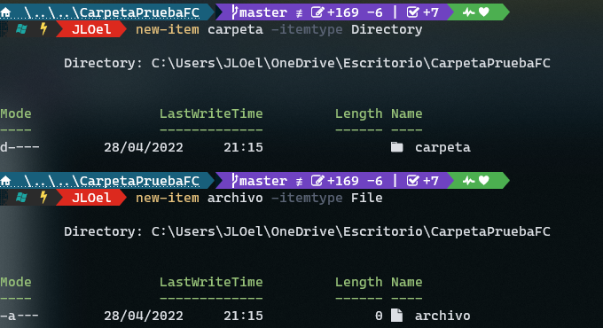

¿Si quisiéramos eliminarlos?

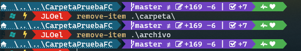

¿Qué pasaría si el directorio que queremos eliminar tiene archivos dentro? Solo con el comando anterior no podríamos eliminarlo.
Para ello tenemos que usar el parámetro `Recurse`

Hacemos una prueba, creamos archivos dentro de un directorio que crearemos ahora\
Pasos: 
* Creamos la carpeta. `new-item carpeta -itemType Directory` (Alias: md carpeta) 
* Nos situamos en la carpeta: `set-location carpeta` (Alias: cd carpeta)
* Creamos el archivo: `new-item archivo -itemType File` (Alias: ni archivo)
* Nos desplazamos una posición atrás de la carpeta: `set-Location ..`(Alias: cd ..)
  * Eliminamos la carpeta sin el parámetro `Recurse`: `remove-item carpeta`(rmdir carpeta). Nos salta una alerta de que vamos a eliminar el contenido de la carpeta.
  * Eliminamos la carpeta con el parámetro `Recurse`: `remove-item carpeta -Recurse`(rmdir -r carpeta). No nos salta nada.

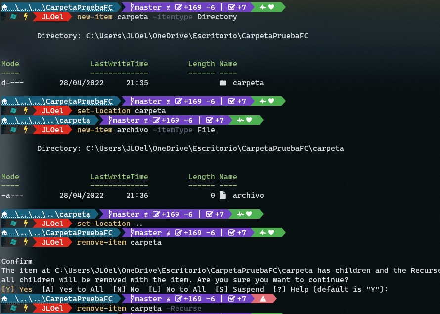

Si intentamos hacer un listado del directorio eliminado nos saltará un error.

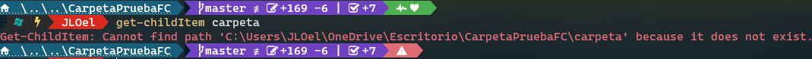

</p>

<strong style="margin-left: 25px"><a style="color:green; font-size:20px" href="#13">2.7. Tuberías y redireccionamiento</a></strong><br>

<p id="Tuberias">

</p>

<strong style="margin-left: 25px"><a style="color:green; font-size:20px" href="#14">2.8. Iniciación a los scripts</a></strong><br>

<p id="Scripts">

</p>

<strong style="margin-left: 25px"><a style="color:green; font-size:20px" href="#15">2.9. Fundamentos de scripts-I: Variables</a></strong><br>

<p id="F1">

</p>

<strong style="margin-left: 25px"><a style="color:green; font-size:20px" href="#16">2.10. Fundamentos de scripts-II: Estructuras de control y funciones</a></strong><br>

<p id="F2">

</p>

<strong><a style="color:magenta; font-size:25px" href="#17">3. Git en Github</a></strong><br>

<p id="Github">

</p>

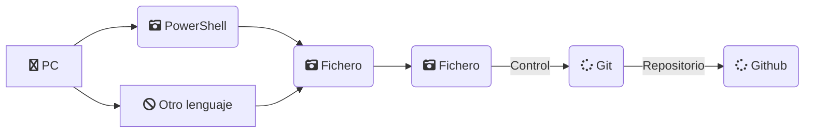

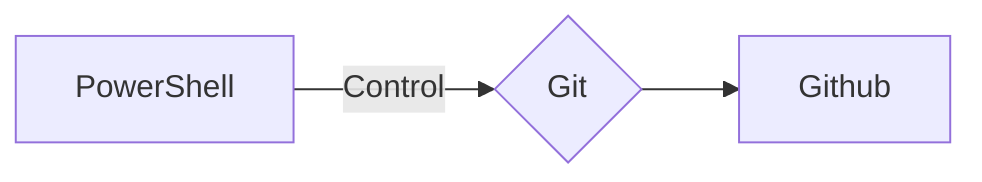
