<span style="font-family:Arial;font-style: normal; font-size:12px">

# PRIMERA ECTS DE FC 💻
    
PowerShell y el uso de Git en Github</h2>

[](https://docs.microsoft.com/es-es/powershell/scripting/overview?view=powershell-7.2)
[](https://github.com/Jloen1999/PrimeraECTSFC)

 <br>
 <br>


***Copyright :copyright: :point_right:José Luis Obiang Ela Nanguan***

<h1><b>Índice de contenido</b></h1>
<ol>
<li><strong><a id="1" href="#Presentación">Presentación</a></strong>
<ol>
<li><strong><a id="2" href="#Objetivos">Objetivos</a></strong></li>
</ol>
</li>
<li><strong><a id="3" href="#PowerShell">PowerShell</a></strong>
<ol>
<li><strong><a id="4" href="#Introducción">Introducción</a></strong></li>
<li><strong><a id="5" href="#Comandos">El paso de CMD a PowerShell</a></strong></li>
<li><strong><a id="6" href="#Significado">¿Qué es PowerShell?</a></strong></li>
<li><strong><a id="7" href="#Consola">La consola de PowerShell</a></strong></li>
<li><strong><a id="8" href="#Ayuda">La ayuda en PowerShell</a></strong></li>
<li><strong><a id="9" href="#module">Obtener Comandos con get-command y get-module</a></strong></li>
<li><strong><a id="10" href="#help">Obtener ejemplos del uso de Comandos con get-help</a></strong></li>
<li><strong><a id="11" href="#atajoAlias">Atajos y Alias</a></strong></li>
<li><strong><a id="12" href="#Archivos">Gestión de archivos y carpetas</a></strong></li>
<li><strong><a id="13" href="#Tuberias">Tuberías y redireccionamiento</a></strong></li>
<li><strong><a id="14" href="#Scripts">Iniciación a los scripts</a></strong></li>
<li><strong><a id="15" href="#F1">Fundamentos de scripts-I: Comentarios, Variables/Constantes</a></strong></li>
<li><strong><a id="16" href="#F2">Fundamentos de scripts-II: Estructuras de control y funciones</a></strong></li>
</ol>
</li>

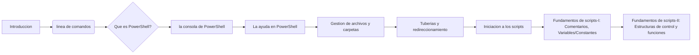

</ol>
<strong><a style="color:magenta; font-size:25px; margin:0" href="#1">1. Presentación</a></strong><br>

<p id="Presentación">
Este curso está planteado en lo más práctico posible. Las Prácticas que vamos a realizar son las siguientes:

> ___En primer lugar empezaremos a trabajar con la PowerShell y la PowerShell ISE___.

> ___Vamos a buscar Información sobre el uso de algunos comandos___.

> ___Vamos a utilizar los comandos básicos relacionados con la gestión de archivos y carpetas___.

> ___Vamos a enlazar la salida de un comando con la entrada de otro y redireccionar la salida___.

> ___Y vamos a realizar pequeños scripts, vamos a hacer scripts en los que combinaremos esctructuras condicionales, repetitivas y redireccionamiento.___

> ___También haremos uso de la herramienta Git y la subida de nuestros scripts a Github___

</p>
<strong style="margin-left: 25px"><a style="color:green; font-size:25px" href="#2">1.1. Objetivos</a></strong><br>

<p id="Objetivos"></p>

***¿Qué vamos a conseguir al finalizar este curso?***

Pues vamos a:

<table style="border: 1px solid">
<tr>
<th><strong>A manejar tanto la PowerShell como la PowerShell ISE con soltura.</strong></th>
<th><strong>Buscar información en la ayuda de PowerShell.</strong></th>
<th><strong>Conocer los comandos básicos.</strong></th>
<th><strong>Ser capaces de realizar scripts para automatizar determinadas tareas.</strong></th>
<th><strong>Conocer los comandos básicos de Git para hacer un buen seguimiento de nuestros proyectos en Github.</strong></th>
</tr>
</table>

<h3 style="color:magenta"><u></u></h3>

<strong><a style="color:magenta; font-size:25px; margin:0px" href="#3">2. PowerShell</a></strong><br>

<p id="PowerShell">

<strong style="margin-left: 25px"><a style="color:green; font-size:20px" href="#3">2.1. Introducción</a></strong><br>

<p id="Introducción">

> La interfaz de usuario es el medio que utilizamos para comunicarnos con el ordenador.

> Interfaz gráfica: GUI(Proporciona un entorno visual).

> Interfaz de línea de comandos: CLI(Command Line Interface, nos permite dar instrucciones por medio de una línea de texto).

**¿Cuál de las dos debemos utilizar?**

> La respuesta es fácil, depende de lo que queramos hacer, si quieres navegar, trabajar con un procesador de texto, hoja de cálculo, retocar fotografía, etc, tu respuesta es la interfaz gráfica
> , pero si lo que quieres es automatizar tareas, crear usuarios de forma masiva, comprobar conectividad con servidores pues la respuesta es PowerShell(La linea de comandos).

</p>   
<strong style="margin-left: 25px"><a style="color:green; font-size:25px" href="#5">2.2. El paso de CMD a PowerShell</a></strong><br>

<p id="Comandos">

Vamos a ver ahora cómo ha evolucionado la línea de comandos de Windows.

___CMD o símbolo del sistema:___

Todavía convive con nosotros, pero cada vez se utiliza menos, tal vez para hacer.

```cmd
ping (Para comprobar si nuestra PC está conectada a la red o para saber si una determinada página está caída)
```


```cmd
ipconfig (Para ver los adaptadores de red de la PC)
```

```cmd
msinfo32 (Para conocer información sobre nuestro sistema)
```

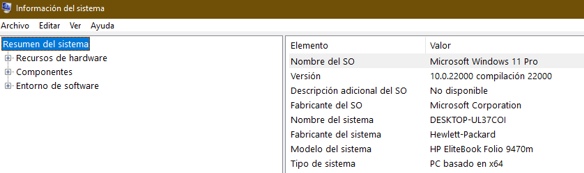

```
regedit (Que es una base de datos donde están los ajustes de configuración y opciones en los sistemas operativos Microsoft Windows.)
```

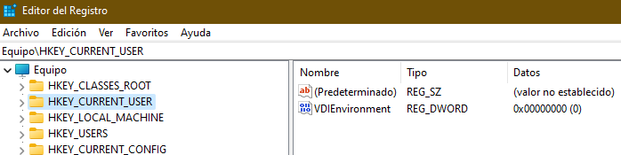

___PowerShell:___

En cambio, la PowerShell se pensó como una herramienta de reemplazo del CMD y con el tiempo se ha convertido en una herramienta poderosa de gestión tanto para usuarios domésticos como administradores.

</p>

<strong style="margin-left: 25px"><a style="color:green; font-size:20px" href="#6">2.3. ¿Qué es PowerShell?</a></strong><br>

<p id="Significado">

<p id="PowerShell">La PowerShell es una nueva línea de comandos, es decir, es una herramienta multiplataforma utilizada principalmente por los administradores de Sistemas Windows para automatizar tareas y tener un mayor control del sistema.
Esta herramienta está formada por una shell de comandos, un lenguaje de scripting y un marco de administración de configuración.
Trabaja con objetos, acepta y devuelve objetos y no acepta ni devuelve texto como lo hace CMD.
PowerShell fue desarrollado por Microsoft el 14 de noviembre de 2006 y está programado en C#.

***¿Dónde podemos encontrar PowerShell por defecto?*** En Windows 10 la encontramos, Windows Server, Microsoft Azure, SQL Server, Sercivios de Office 365, se encuentra prácticamente en todos los productos de Microsoft. Se puede instalar en Linux o MacOS.

<table>
    <thead>
        <tr>
           <th colspan="2">Versiones</th>   
        </tr>
    </thead>
    <tbody>
        <tr>
            <th>Versión</th>
            <th>año</th>
        </tr>
        <tr>
            <th>V1</th>
            <th>2006</th>
        </tr>
        <tr>
            <th>V2</th>
            <th>2009</th>
        </tr>
        <tr>
            <th>V3</th>
            <th>2012</th>
        </tr>
        <tr>
            <th>V4</th>
            <th>2013</th>
        </tr>
        <tr>
            <th>V5</th>
            <th>2016</th>
        </tr>
        <tr>
            <th>V5.1</th>
            <th>2017</th>
        </tr>
        <tr>
            <th>V Core 6.0</th>
            <th>2018</th>
        </tr>
        <tr>
            <th>Versión actual 7.2.2</th>
            <th>2022</th>
        </tr>
    </tbody>
</table>
No tenemos que confundir:

* Windows PowerShell ISE, es un entorno en el que podemos ejecutar comandos, escribir, probar y depurar script.
* Windows PowerShell es la consola de comandos.

***¿Qué requisitos se necesitan para aprender dicha herramienta?***

> Como se trata de un curso en el ámbito de iniciación en PowerShell, cualquier persona con conocimientos de informática a nivel de usuario podría hacerlo sin mayor problema, ahora bien hay una parte en la que se habla de variables y estructuras condicionales y entonces aquí si se requiere conocimientos mínimos de programación.

***¿Qué máquina necesitamos para trabajar en PowerShell?***

> Es suficiente con tener un Windows 10 instalado o bien un Windows Server.

<p id="Consola"><strong style="color:green;font-size: 25px; margin-left: 18px" ></strong>
<strong style="margin-left: 25px"><a style="color:green; font-size:20px" href="#7">2.4. La consola de PowerShell</a></strong><br>

<p id="Consola">

Hay varias maneras de abrir la consola de comandos en Windows:

* Dando clic derecho sobre el símbolo de Windows y pinchamos donde aparece PowerShell.
* Pulsando  y escribimos `PowerShell`.

Podemos ver la versión que tiene nuestro PowerShell con el comando `get-host`.

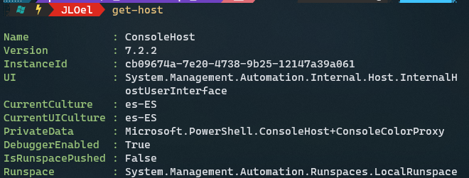

**Concepto de cmdlet**:

> Los comandos en PowerShell se llaman cmdlet. Es una combinación de verbo y nombre separados por un guión`(-)`.
>
>> Verbo(Verb): describe la acción que se va a realizar.
>>
>
>> Nombre(Noun) es el objeto sobre el que se va a realizar la acción.
>>

<span style="color:red">NOTA: PowerShell incorpora incluso muchos de los comandos de Linux.</span>

Para entender mejor, ahora abrimos la línea de Comandos PowerShell.

* Ejemplos de Verbos:
  * `get`(Obtiene una información)
  * `set`(Cambia una propiedad)
  * `remove`(Elimina un objeto)
  * `new`(Crea un objeto)

Pero estos verbos no hacen nada si no les aplicamos un nombre

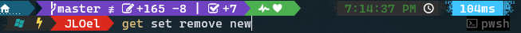

* Ejemplos de Nombres:
  * `localuser`
  * `localgroup`
  * `netadapter`
  * `partition`
  * etc..

Pero estos nombres tampoco hacen algo si no les aplicamos un verbo.

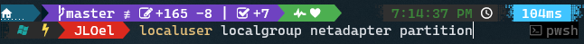

* Parámetros. Los comandos en PowerShell también tienen parámetros y podemos combinarlos:

  * _Path_ (Para especificar la ruta del directorio que puede ser absoluta o relativa)
  * _Force_ (Para mostrar también los archivos ocultos o para borrar un elemento de manera forzosa)
  * _Recurse_ (Para mostrar, copiar o mover absolutamente todos los archivos)
  * _Filter_ (Para hacer un filtro a la hora buscar información)
  * _Include_ (Hace lo mismo que Filter, pero siempre va precedido del parámetro Recurse)
  * _Exclude_ () (Siempre va precedido del parámetro Recurse y sirve para mostrar solo los elementos que indicamos en el parámetro)
  * etc...
* Campos: La información suele mostrarse por campos, por lo tanto, también podríamos hacer un filtro de lo que queremos mostrar especificando el nombre del campo seguido del elemento a buscar.

Vamos a combinar los verbos y los nombres a ver si ahora conseguimos algo.<span style="color: blue">Ejemplos: </span>

* `Get-localuser`(Muestra todos los usuarios locales del sistema).


<span style="color:red">NOTA: Una cosa, PowerShell no es case sensitive, es decir, no distingue mayúsculas de minúsculas, es decir, puedes poner un comando con mayúsculas o minúsculas o puedes acceder a un archivo de igual manera</span>

* `get-date`(Para saber la fecha actual del sistema)

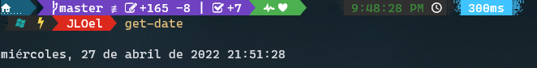

* `clear-host`(Para limpiar la pantalla)
* `get-location`(Para saber mi directorio actual)

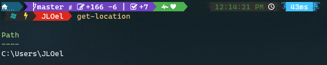

* `get-childItem`(Para ver los ficheros y carpetas que hay en nuestra ubicación actual o lo que especifiquemos nosotros)

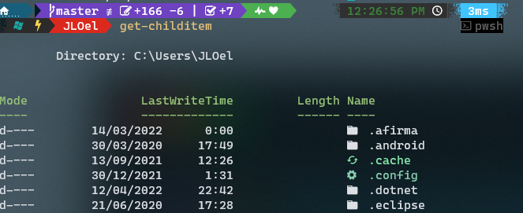

* `get-netadapter`(Para visualizar los adaptadores de red)

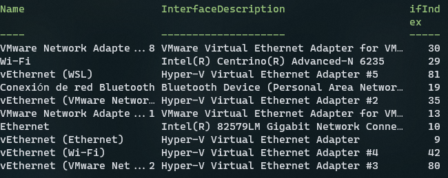

* `get-service`(Para ver cuáles son los procesos en segundo plano que se están ejecutando en nuestra máquina)

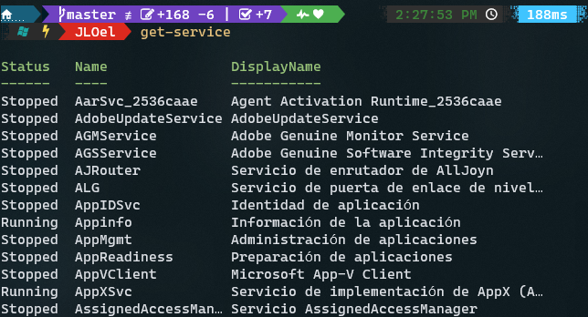

Por ejemplo si quisiéramos un servicio en concreto, podríamos hacerlo especificando el nombre del campo como parámetro y a continuación el nombre del servicio.

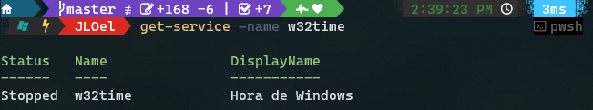

Digamos que estos son los comandos que conocemos. Entonces imaginaros que queremos usar un comando y no se cómo se escribe exactamente.

<strong style="color:green;font-size: 18px; margin-left: 18px"><a style="color: green" href="#8">2.5. La ayuda en PowerShell</a></strong><br>

<p id="Ayuda"></p>
<strong style="font-size: 18px; margin-left: 20px"><a style="color: yellow" href="#9">2.5.1. Obtener Comandos con get-command y get-module</a></strong><br>

<p id="module">Si yo pongo el comando <code>get-command</code>lo que conseguimos es visualizar todos los comandos que tiene la PowerShell.

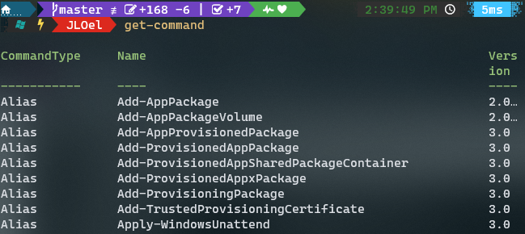

***Ejemplo:*** Estoy buscando un comando que tiene que ver con un verbo determinado

`get-command -verb new` (Busca aquellos comandos que tengan que ver con el verbo new)

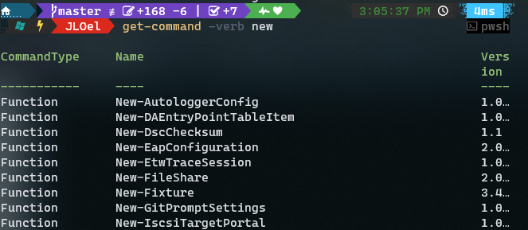

De igual manera podemos buscar los comandos que tienen que ver con un nombre en concreto

`get-command -noun localgroup` (Muestra aquellos comandos que tengan el nombre localgroup)

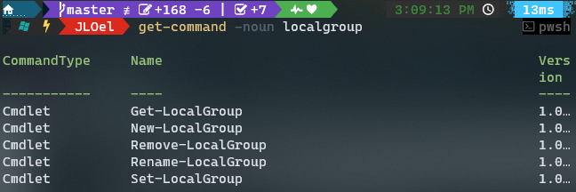

Y si quisiera buscar absolutamente todos los comandos que incluyan la palabra localgroup haríamos lo siguiente

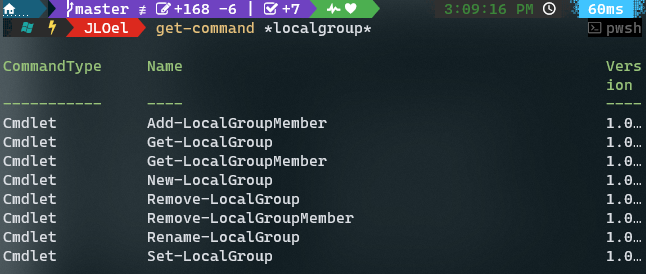

Ahora vamos a ver el concepto de módulo.

***Concepto de Módulo:***

> Un módulo no es nada más que un conjunto de comandos

Para ver los módulos que hay en el sistema ejecutamos el siguiente comando
`get-module`

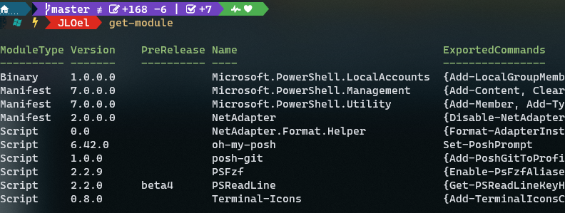

Si queremos ver los comandos que tiene un determinado módulo pondríamos `get-command -module <nombre_modulo>`

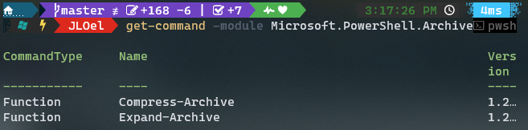

Si queremos saber cuáles son los módulos que se encuentran disponibles ejecutamos el comando

`get-module -ListAvailable`

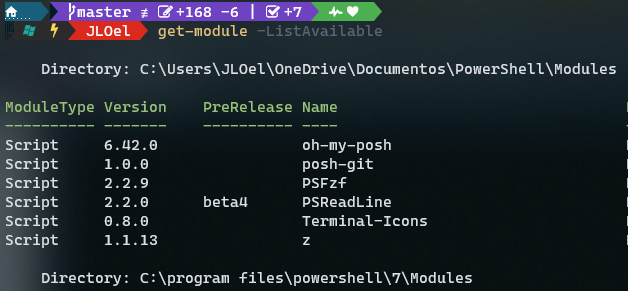

Digamos que queremos trabajar con los comandos del módulo BitLocker que no están en memoria, ejecutamos el comando `import-module bitlocker`


Ahora comprobamos que el módulo ha sido importado correctamente, ejecutamos nuevamente el comando
`get-module`

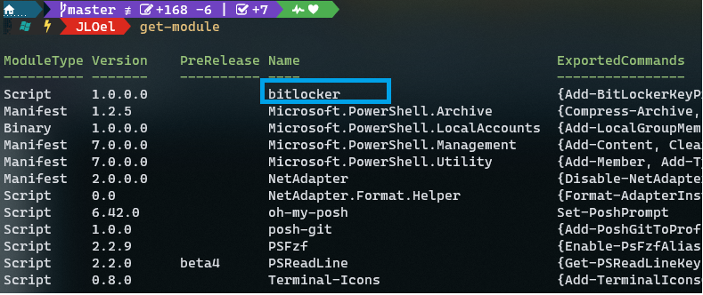

El módulo bitlocker ya está disponible en memoria, por lo tanto, ya podemos trabajar con sus comandos.
Si quisiéramos eliminar dicho módulo solo cambiamos el verbo `get` por `remove` y especificamos el nombre del módulo el cual queremos eliminar

`remove-module bitlocker`

Y comprobamos que ya no está con el comando `get-module`


</p>
<strong style="font-size: 18px; margin-left: 20px"><a style="color: yellow" href="#10">2.5.2. Obtener ejemplos del uso de Comandos con get-help</a></strong><br>
<p id="help">
¿Y ahora qué pasa si queremos buscar información e incluso ejemplos del uso de un comando?
<pre>Entonces necesitamos la ayuda de PowerShell.
La ayuda en PowerShell es muy completa y trae muchos ejemplos, necesitamos acceso a internet para descargarla, eso puede parecer una limitación pero nos permite tener una ayuda actualizada de los comandos.
Para actualizar la ayuda de PowerShell necesitamos el comando <span style="color:blue">update-help</span>, para tener incorporado las últimas novedades, la ayuda de PowerShell nos da muchos ejemplos del uso de cada comando.</pre>

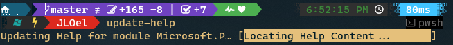

Existen tipos de ayuda en PowerShell:

- Ayuda estándar: `get-help <nombre_comando>`
- Ayuda con ejemplos: `get-help <nombre_comando> -examples`
- Ayuda con ejemplos y más detalles: `get-help <nombre_comando> -detailed`
- Ayuda Completa: `get-help <nombre_comando> -full`
- Ayuda Online: `get-help <nombre_comando> -online`

Vamos a verlo sobre la marcha, por ejemplo necesitamos crear la cuenta de un usuario, pero no sabemos nada sobre la sintaxis de ese comando.
Pues usamos lo siguiente. `get-help new-localuser`

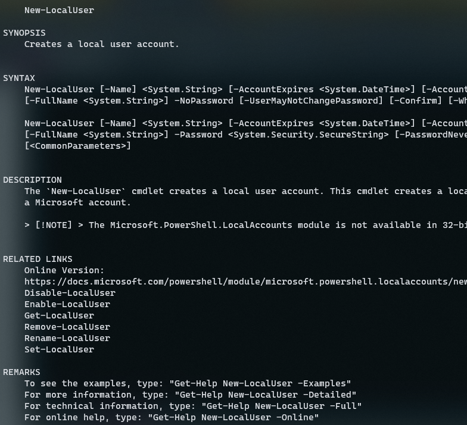

Digamos que aun no me he enterado bien sobre el uso del comando, voy a hacer que me una ayuda a través de los ejemplos.

`get-help new-localuser -examples`


<span style="color:red">NOTA: Como crear o eliminar un usuario es una operación que necesita permiso de administrador tenemos que abrir nuestra PowerShell como administrador</span>

<strong style="font-size: 18px; margin-left: 35px"><a style="color: yellow" href="#10">2.5.3. Atajos y Alias</a></strong><br>

<p id="atajoAlias">

* ***Atajos:***
  > La mayoría de los administradores quieren escribir los comandos lo más rápido posible, para ello usan los tabuladores.
  > ¿Qué hace el tabulador? Nos completa el comando que estamos escribiendo, si hay más de una opción podemos verla con los cursores.
  >
* ***Cursor:***
  > Nos permite seleccionar un comando ejecutado anteriormente.
  >
* ***Historial:***
  > Otra función más interesante es el historial, entonces si yo digo dame el historial de todos los comandos que he ejecutado,
  > usamos el comando `get-history`
  >

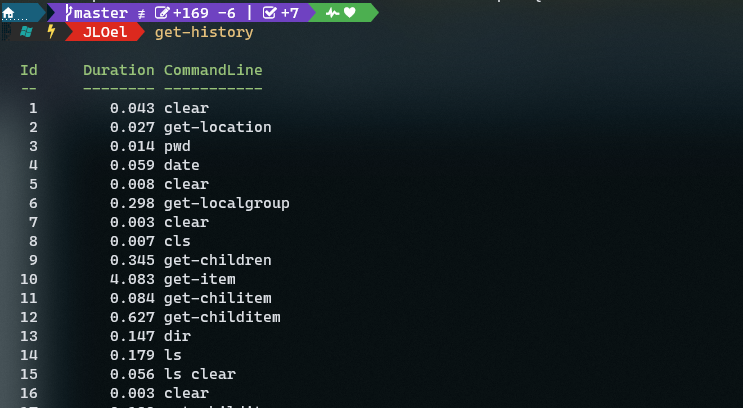

Por ejemplo si yo ejecuto `get-process` para saber todos los procesos que se están ejecutando ahora


Vemos que sí se ha guardado en el historial


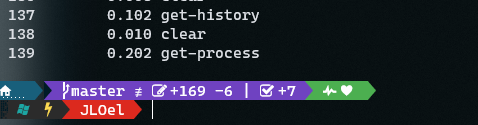

Si quisiéramos ejecutar por ejemplo el comando que está en el historial en la línea 2 lo hacemos con el comando
`invoke-history <posicion_historial>`

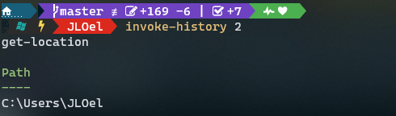

Pero veo que es escribir mucho, mirar con tan solo escribir `h` nos muestra el historial de comandos

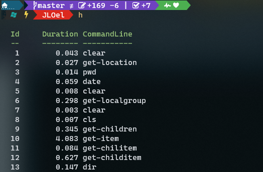

Por ejemplo si quiero ejecutar nuevamente el comando de la línea 2 del historial de comandos podría hacerlo solo con este comando

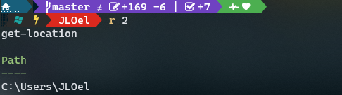

Es una forma muy abreviada y fácil de buscar y ejecutar comandos del historial.

Una utilidad que uso mucho es buscar un comando del historial con 

Por ejemplo si quisiera buscar un comando relacionado con `new`, y cada vez que pulso  me van apareciendo los comandos. Es una forma bastante fácil y util de buscar un comando en el historial de ayuda.

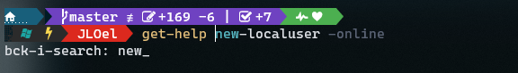

Si quisiéramos eliminar todo el historial de comandos usamos el comando `clear-history`

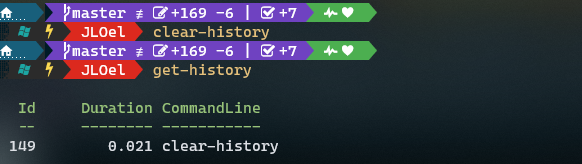

Tanto los historiales, los tabuladores y los cursores nos pueden ayudar a escribir los comandos de una forma más rápida.

* ***Alias:***
  > El alias no es nada más que un apodo o un sobrenombre para referirse a un Cmdlet
  >

Vamos a ver los alias que tiene el sistema con el comando `get-alias`

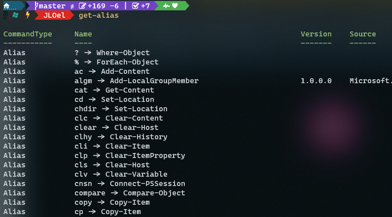

Como podemos observar muchos de los alias son iguales que los comandos que se usan la shell de Linux

Digamos que queremos saber si un comando tiene alias solo necesitamos este comando
`get-alias -Definition <Cmdlet>`


Voy a usar el que más se parece a Linux, el `ls`

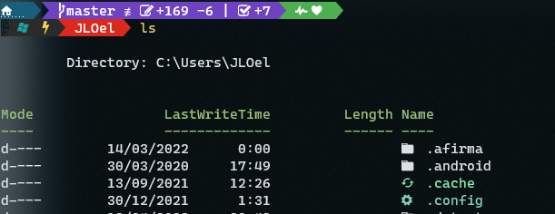

Y así existen un montón de alias.

Por ejemplo voy a crear un archivo y luego quisiera ver su contenido. Con el alias es bastante fácil


Pero sin Alias sería algo así:
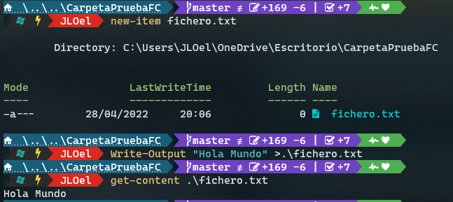

<strong style="margin-left: 25px"><a style="color:green; font-size:20px" href="#12">2.6. Gestión de archivos y carpetas</a></strong><br>

<p id="Archivos">

Ahora vamos a ver el tema de gestión de archivos y carpetas.

* Veremos los principales comandos para trabajar con archivos y carpetas.
* También vamos a hacer uso de los alias.

Existen 3 comandos fundamentales que son.

* ***`Get-Location`(pwd)***: nos devuelve la ruta o path en la que nos encontramos.
* ***`Set-Location`(cd)***: es para desplazarnos por la estructura de directorios.
* ***`Get-ChildItem`(ls)***: nos permite mostrar el contenido de un directorio.
  * Cuando mostramos el contenido de un directorio en el campo Mode nos aparecen unas letras.
    * d: directorio
    * a: archivo
    * s: archivo del sistema
    * h: archivo oculto
    * r: lectura
    * w: escritura
    * x: ejecución

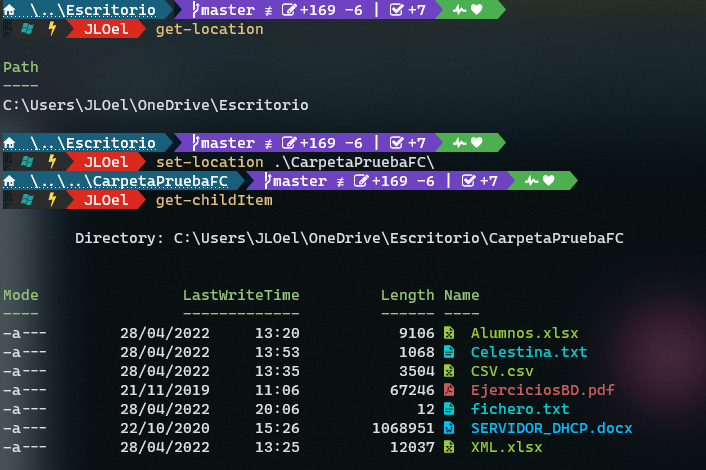

Digamos que queremos ver los archivos ocultos que hay en tu sistema, normalmente los archivos ocultos suelen estar en la raíz para que no puedan entrar los virus.


A algunos a lo mejor les aparezca el gestor de arranque de Windows bootmgr, el pagefile es donde están los archivos de paginación.

* ***`New-Item`:***
* Nos permite crear archivos y directorios
* Alias:
  * ni :arrow_right:Archivos
  * md :arrow_right:Directorios

Vamos a crear un archivo y un directorio
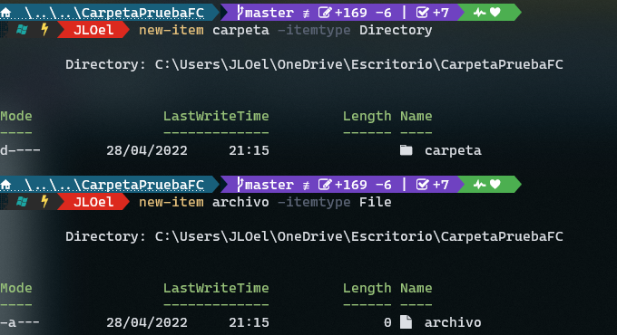

¿Si quisiéramos eliminarlos?

* ***`remove-item`:***
  * Permite eliminar archivos o carpetas
  * Alias:
    * rm:arrow_right:Archivos y carpetas

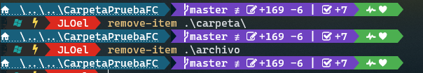

¿Qué pasaría si el directorio que queremos eliminar tiene archivos dentro?

> Solo con el comando el sistema nos preguntaría si queremos borrar la carpeta
> Para que no nos pregunte usamos el parámetro `Recurse`

Hacemos una prueba, creamos archivos dentro de un directorio que crearemos ahoraPasos:

* Creamos la carpeta. `new-item carpeta -itemType Directory` (Alias: md carpeta)
* Nos situamos en la carpeta: `set-location carpeta` (Alias: cd carpeta)
* Creamos el archivo: `new-item archivo -itemType File` (Alias: ni archivo)
* Nos desplazamos una posición atrás de la carpeta: `set-Location ..`(Alias: cd ..)
  * Eliminamos la carpeta sin el parámetro `Recurse`: `remove-item carpeta`(rmdir carpeta). Nos salta una alerta de que vamos a eliminar el contenido de la carpeta.
  * Eliminamos la carpeta con el parámetro `Recurse`: `remove-item carpeta -Recurse`(rmdir -r carpeta). No nos salta nada.

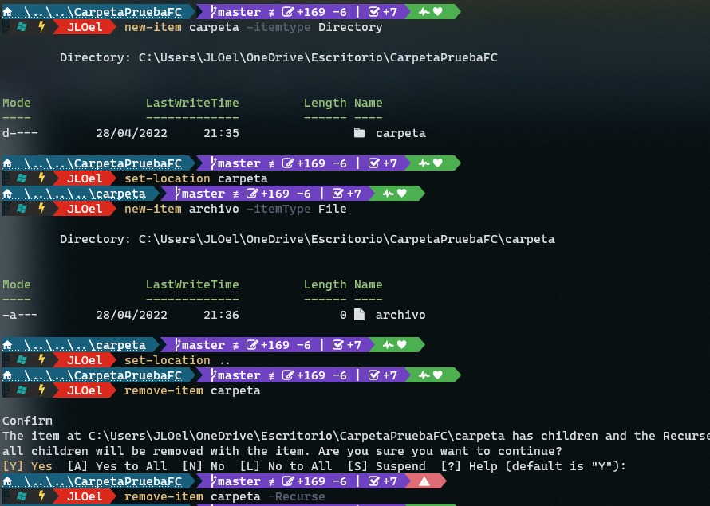

Si intentamos hacer un listado del directorio eliminado nos saltará un error.

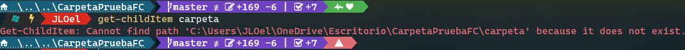

Vamos a ver ahora otro comando que sirve para mover elementos, objetos de un sitio a otro

* ***`move-item`***
  * Permite mover elementos u objetos de un sitio a otro
  * Alias:
    * mv: Archivos y Directorios
    * mi: Archivos y Directorios
      Ejemplo: crearemos unos cuantos archivos, luego crearemos una carpeta y dichos archivos las moveremos a la carpeta creada.
    * Pasos:
      * Creamos el|los archivos: `new-item <nombre_archivo>`(sin especificar el tipo de archivo con el parámetro itemType, por defecto estaríamos creando un archivo)
      * Creamos la carpeta en la cual moveremos dichos archivos: `new-item <nombre_carpeta> -itemType Directory`
      * Movemos los archivos a la carpeta: `move-item <archivoCreado> <carpetaCreada>`
      * Podemos comprobar que los archivos han sido movidos correctamente de tres maneras:
        1. Pasando al comando `get-childItem` la ruta relativa de carpeta
        2. Pasando al comando `get-childItem` la ruta absoluta de carpeta
        3. O bien situándonos primero a la ubicación de la carpeta `set-location <carpetaCreada>` y luego ejecutar el comando `get-childItem` sin especificar ninguna ruta
           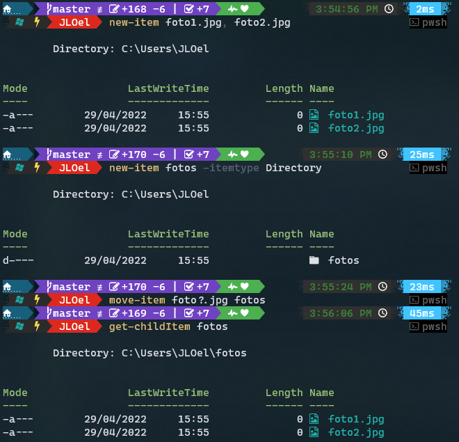

¿Y ahora en vez de mover un archivo quisiéramos copiarlo?

* ***copy-item***
  * Copia un archivo o carpeta
  * Alias:
    * cp
    * copy
      Por ejemplo:
  * Pasos:
    * Creamos una nueva carpeta en la cual moveremos el|los archivos: `new-item <nombre_carpeta> -itemType Directory`
    * Hacemos la copia:
      * Copiar una carpeta a otra:  `copy-item <carpeta_Creada> <nuevaCarpeta> -Recurse`(Parámetro `Recurse` es para que también se copie el contenido de la carpeta origen a la carpeta destino)
        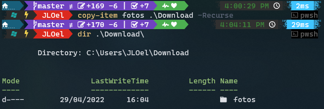
        <span style="color:red">NOTA: Si intentamos copiar una carpeta a otra que no existe, esa se creará automáticamente con el contenido de la carpeta copiada</span><br>
        Ejemplo: 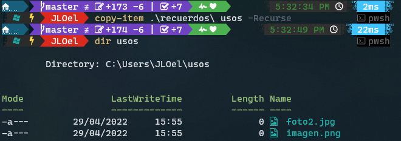
      * Copiar un archivo a una carpeta: `copy-item <fichero_Creado> <nuevaCarpeta>`
        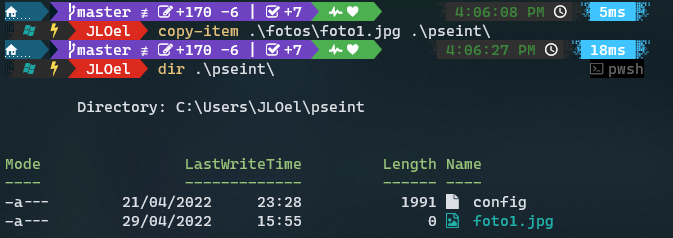

Ahora pasamos al uso del comando rename-item

* ***rename-item***
  * Permite renombrar archivos y carpetas.
  * Alias:
    * ren
      Por ejemplo:
    * Renombrar carpetas.
      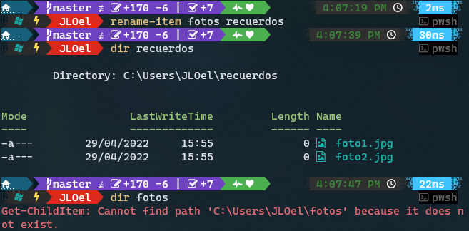
      Como podemos observar la carpeta fotos ya no existe, ya que lo hemos renombrado a recuerdos.
    * Renombrar archivos. Si quisiéramos renombrar al archivo foto1.jpg que habíamos creado previamente, lo hacemos de la siguiente manera.
      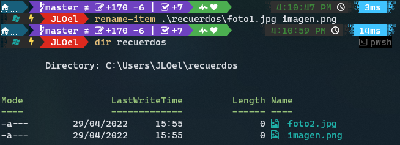

Digamos que queremos editar el contenido de un archivo.
Creamos el archivo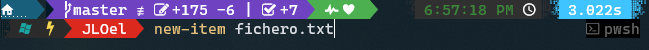
Podemos hacerlo de varias maneras.

* Con el block de notas Notepad: `notepad <nombre_archivo>`
* Desde la consola de PowerShell, para ello tendremos que instalar el editor nano o vim.
  * Instalación:

    * Primero instalamos el paquete de instalación chocolatey, que nos ayudará a instalar los editores: `Set-ExecutionPolicy Bypass -Scope Process -Force; iex ((New-Object System.Net.WebClient).DownloadString('https://chocolatey.org/install.ps1'))`
      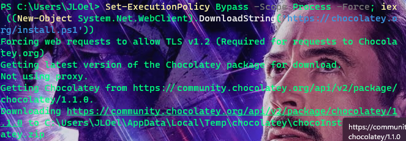
    * Ahora procedemos a instalar los editores:
      * nano--> `choco install nano`
        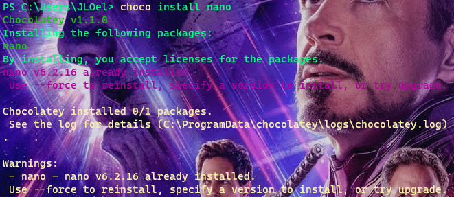
      * vim-->`choco install vim`
        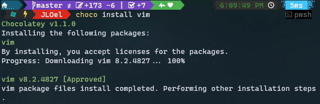
        <span style="color:red">NOTA: Puede que el editor nano o vim ya vengan por defecto.</span>
  * Procedemos a editar un archivo de tres maneras distintas:\

    1. Con el comando: `wsl nano|vim <nombre_archivo>`, tendremos que introducir la ruta absoluta del archivo como si lo estuviéramos introduciendo en una distribución de Linux del WSL.
       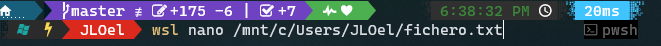
    2. Con el comando: `bash -c "nano|vim <nombre_archivo>"`
       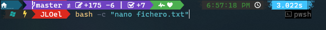
    3. O simplemente con el comando `nano|vim <nombre_archivo>`, pero para ello primero tendremos que seguir los siguientes pasos:

    * Primero abrimos el fichero de configuración `$profile` de PowerShell, por ejemplo con el notepad.
      
    * Luego añadimos las siguientes líneas:

    ```bash
    function vi ($File){
       bash -c "vi $File"
    }

    function nano ($File){
       bash -c "nano $File"
    }
    ```

    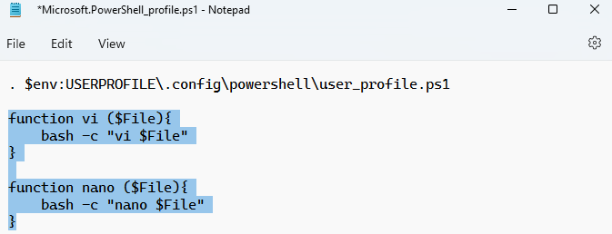
  * Ya dentro del archivo procedemos a escribir lo que quisiéramos:

    <span style="color:red">NOTA: Para entrar en modo edición en vim pulsa la tecla `i`, para entrar en modo lectura pulsa la tecla `ESC`.</span>
  * Para guardar y salir de la edición:

    * nano:
      * Guardar: .
      * Salir: 
    * vim:
      * Primero entramos en modo lectura con la tecla `ESC`.
        * Guardar: .
        * Salir: 
  * Ahora procedemos a leer el contenido con normalidad.
    
    Y ahora si quisiéramos leer el contenido del archivo, usamos el comando `get-content`.
* ***get-content:***
  * Nos permite ver el contenido de un archivo.
  * Alias:
    * cat
      Ejemplo:
      

</p>

<strong style="margin-left: 25px"><a style="color:green; font-size:20px" href="#13">2.7. Tuberías y redireccionamiento</a></strong><br>

<p id="Tuberias">
Imaginemos que necesitamos conocer todos los archivos que tengan más de 4GB y ordenados de mayor a menor.<br> 
¿Y eso cómo lo vamos a hacer? 
Pues con <strong>tuberías</strong>.<br> 
Y digamos que además necesitamos que se almacene en un archivo y eso cómo lo haríamos?, pues con <strong>Redireccionamiento.</strong>

Vamos a empezar con las tuberías.

* Tuberías:
  * Las tuberías nos permiten conectar la salida de un Cmdlet con la entrada de otro, que la tratará como su información de inicio.
  * Utilizaremos el carácter | (tubería o pipe) para enlazar los comandos.
  * Vamos a ver ejemplos:

Primero vamos a ver un comando que ya vimos llamado `get-command` pero ahora no queremos mostrarlos sino contar el total pero para ello usamos comando.
`get-command|measure-object`

(El último comando recibe como entrada todos los comandos gracias a la tubería y devuelve el total).


> `get-childItem -Recurse | where-object {$_.Length -gt 100Mb}`
>
>> El primer comando Get-ChildItem -Recurse: devuelve un objeto de archivo o directorio para cada elemento del directorio actual del sistema de archivos. Los objetos de archivo y directorio se pasan por la canalización al segundo comando.
>> El segundo comando usa where where-object {$_.Length -gt 100Mb} la propiedad Length de todos los objetos del sistema de archivos para seleccionar solo los archivos, que tienen un tamaño mayor de 100Mb.
>>

Vamos a ver si nos sale algo.


Y si también quisiéramos ordenarlos en orden descendente por la propiedad longitud haríamos lo siguiente:
Fijaros que hemos empleado dos filtros, el primero recoge lo que devuelve el primer comando y el segundo lo que devuelve el segundo comando.
Fijaros la utilidad que tienen los filtros.


Vamos a otro ejemplo que yo creo que es importante.
__Imaginaros como administrador necesitáis averiguar aquellos puertos en los que se ha producido una conexión. El comando sería `get-netTCPConnection`__

Pero debido a que no se ve bien la información lo ejecutaremos de la siguiente manera  `get-netTCPConnection|format-table -autosize`, porque lo que hace ahora es visualizar la información en formato tabla y que se ajuste mejor a la pantalla.


¿Qué pasa si quisieramos ver solo aquellas conexiones establecidas?

Pues solo necesitamos hacer un filtro.


Vamos a ver ahora el tema de Redireccionamiento

* ***Redireccionamiento:***
  * Las redirecciones nos permiten mandar los resultados a un lugar diferente de la pantalla. Normalmente a un archivo.
  * `>`: Crea un nuevo archivo y deposita en él la salida del cmdlet.
    
  * `>>`: Añade al contenido del archivo la salida del cmdlet.
    Solo he añadido la fecha 

Las salidas de los comandos anteriores también podríamos añadirlos al mismo archivo con el signo `>` pero si quisiéramos sobreescribir entonces sería con `>>`, por ejemplo, el comando que nos mostraba las conexiones o puertos abiertos.


En este último comando como podemos fijarnos hemos utilizado un comando, tuberías y redireccionamiento.

</p>

<strong style="margin-left: 25px"><a style="color:green; font-size:20px" href="#14">2.8. Iniciación a los scripts</a></strong><br>

<p id="Scripts">

***¿Qué es un script?***

> Bueno, los administradores de sistemas utilizan principalmente los scripts para automatizar tareas, pero qué es un script?
>
>> pues un script es un archivo de texto plano que contiene una secuencia de órdenes o comandos.
>> Para que un archivo sea tratado como un script tiene que tener una extensión de ps1.
>>

***¿Para qué se usa un script?***

> Podríamos usar un script para automatizar tareas, por ejemplo para:

* Comprobar si un determinado servicio está activo y si se ha detenido lo quiere activar.
* Realizar una copia de seguridad en un viernes a las 3PM.
* Copia de seguridad del sistema por ejemplo a las 6AM.
* Creación de usuarios de manera masiva.

Fijaros la gran utilidad que tiene a la hora de automatizar tareas el uso de los scripts.

Ahora vamos a ver el punto de seguridad en los scripts.

***Seguridad en los scripts:***
PowerShell incorpora medidas de seguridad para evitar que se ejecuten sin la autorización del usuario scripts que puedan dañar al equipo y ha establecido 4 niveles de seguridad.

* Niveles de seguridad:
  * Restricted. Es el nivel predeterminado que no permite la ejecución de scripts.
  * AllSigned. Todos los scripts deberán estar autenticados para poder ejecutarlos, es la opción más segura.
  * RemoteSigned. Solo deberán ser autenticados los scripts que proceden de una ubicación remota, es decir, solo funcionarían nuestros scripts y aquellos que se bajen de la red pero que estén autenticados.
  * Unrestricted. Permite la ejecución de cualquier script y por eso es la opción menos segura.

Vamos a abrir nuestro PowerShell como administrador.
Ahora procedemos a comprobar la política de seguridad que tenemos establecida con el comando `get-executionPolicy`


Bypass es parecido a Unrestricted.

Procedemos a cambiar nuestra política de seguridad a RemoteSigned, es decir, nuestros scripts se podrán ejecutar pero los que sean remotos solo se podrían ejecutar si están autentificados.


Vamos a crear nuestro primer Script, primero lo haremos con algún block de notas que tengamos y lo llamaremos ejemplo1.ps1(el ps1 es la extensión de los scripts en PowerShell)

Nuestro primer script primero limpia la pantalla, luego crea un fichero, introduce texto, limpia otra vez la pantalla y por último muestra el contenido del archivo.


Para ejecutarlo simplemente escribimos la ruta del archivo punto PS1.


Hemos hecho un script simplemente utilizando un procesador de texto como Notepad pero ahora usaremos el entorno que trae PowerShell para desarrollar script, es lo que se llama Windows PowerShell ISE.

Este entorno tiene dos partes, una parte en la que escribimos el script y otra parte en la que se ejecutan los scripts y también podemos ejecutar comandos. Hay una cosa muy interesante que nos permite depurar los scripts.

***PowerShell ISE***

* PowerShell dispone de un entorno gráfico llamado PowerShell ISE(Integrated Scripting Environment)
* Su gran ventaja es que integra las tareas relativas a la escritura, deppuración y ejecución de scripts.

Vamos a crear un nuevo script el cual llamaremos ejemplo2.
Podemos ejecutar todo el script.

O bien solo las líneas que seleccionemos desde la opción ejecutar selección

Si quisiéramos añadir un punto de ruptura en alguna línea de nuestro script, digamos en la línea 2.
Primero le damos al botón derecho y seleccionamos la opción alternar puntos de interrupción, entonces cuando le das ejecutar se va a parar la ejecución en dicha línea

y después si quiero ver lo que va pasando poco a poco pulsaría `F11` y continuaría la ejecución en línea a línea a línea cada vez que le doy al `F11`


</p>

<strong style="margin-left: 25px"><a style="color:green; font-size:20px" href="#15">2.9. Fundamentos de scripts-I: Comentarios, Variables/Constantes</a></strong><br>

* Cualquier script debe tener líneas de comentarios, que explique algún detalle en concreto o algún procedimiento.
* Es fundamental saber correctamente las variables.
* ***Comentarios:***

  * Hay dos formas de comentarios:

    * En línea. Empiezan solo con una `almohadilla`(#).
    * En bloque:
      * <#
      * Todo lo que vaya
      * Entre etiquetas
      * También se comentarios
      * #>

    Creamos un archivo el cual llamaremos comentarios, incluimos comentario en línea, comentario en bloque y algún comando.
     Si los comentarios están bien hechos no debería mostrar el texto comentado.
* ***Variables:***

  * Es un espacio en memoria, que contiene un valor que puede cambiar.
  * No es obligatorio declararla, ni inicializarla.
  * Es suficiente con utilizar el signo `=` para asignarle un valor. PowerShell se encargará de crearla y determinar el tipo.
  * El primer carácter debe ser siempre un símbolo `($)`.

Vamos a hacer una prueba:

PowerShell en función del dato que pongas es capaz de asignar un tipo a una variable, las cadenas van entre comillas y los números sin comillas.
Si quisiéramos saber qué tipo de dato es una variable, usamos, el comando `$nombre_variable.GetType()`

También podríamos declarar variables con el cmdlet `new-variable -name nombre_variable [-value valor]`


* ***Constantes:***
  * Las constantes son variables cuyos valores no pueden cambiarse
  * Se crean con el comando `new-variable -name nombre_variable [-value valor] -option constant`

Si intentamos cambiar el valor de una constante nos saldrá el siguiente mensaje.


***Tipos de datos con los que trabaja PowerShell***


| Tipos de datos | Descripción               |
| ---------------- | ---------------------------- |
| int            | Entero con signo           |
| Double         | Números decimales         |
| Char           | Un solo carácter          |
| String         | Una cadena de texto        |
| Boolean        | Valor lógico(True o False |

<p id="F1">

</p>

<strong style="margin-left: 25px"><a style="color:green; font-size:20px" href="#16">2.10. Fundamentos de scripts-II: Estructuras de control y funciones</a></strong><br>

<p id="F2">

Esta es la parte más interesante porque trabajaremos con Estructuras de control, condiciones y funciones.

Como cualquier otro lenguaje, PowerShell también tiene estructuras de control, que permiten modificar e flujo de ejecución de las instrucciones de un programa.

* Por ejemplo dependiendo de una condición se puede ejecutar un grupo u otro de sentencias.
* Dependiendo de la condición se puede ejecutar un grupo determinado de sentencias un número determinado de veces.

> PowerShell incorpora una funcionalidad muy útil denominada snippets, que son estructuras de código listas par ser usadas. Vamos a verlo ahora cuando hablemos de las estructuras condicionales.

* ***Estructuras condicionales:***
  * Las estructuras condicionales ejecutan un grupo de sentencias en función del valor de una condición.

Vamos a verlo con un ejemplo:
Con las teclas  podemos elegir el código base de la estructura de control que queramos


**Vamos a hacer un script que comprueba la conectividad con el servidor pero para ello primero tenemos que abrir la ISE de PowerShell como administrador.**

Pasos:

* Limpiamos la pantalla: `Clear-Host`.
* Mostramos el mensaje Conectividad: `Write-Host "Conectividad"`.
* Pedimos al usuario que introduzca una dirección IP, la cual la almacenamos en una variable: `$IP=Read-Host "Introduce una IP "`
* Comprobamos la conectividad, el comando nos devuelve un valor booleano, por lo tanto, lo almacenaremos en una variable: `$conexion=Test-Connection $IP -count 1 -Quiet`
  * -count: Indica la cantidad de Ping
  * -Quiet: Muestra si hay conexión o no hay.
* Evaluamos una condición según si hay conexión o no con la estructura condicional if-else.
  * if: si se cumple nos mostrará el mensaje "$ip conexión establecida".
    
  * else: "$ip Error de conexión".
    Esta IP no está en nuestra red 

***¿Para qué puede servir este script?*** Imaginaros que tenemos un fichero con todos los servidores que nos interesa, podemos hacer una conexión con cada uno de esos servidores y elaborar un informe que nos diga qué servidor está disponible y cuál no?

* ***Estructuras repetitivas:***
  * Nos permiten repetir un bloque de instrucciones.
  * Tipos:
    * While. Se repite la condición cero o más veces de manera
    * Do-while. Se repite el bloque de código por lo menos una vez.
    * For. Se repite la condición un número determinado de veces.
    * Foreach. Lo usaremos para recorrer una colección de datos.

Vamos a suponer que la IP de los servidores lo tenemos en un fichero de texto, el cual creamos ahora.
 En este fichero tenemos las IP de los servidores.

Ahora como queremos hacer lo mismo que el script anterior pero para muchas Ip de servidores tendríamos que usar una estructura repetitiva.
Como ya no necesitamos introducir las IP ya que hemos creado un fichero que contiene las IP.
Para obtener las IP del fichero usamos el cmdlet `get-content <path_archivo>` y lo almacenamos en una variable.
Luego hacemos un bucle con la estructura repetitiva `foreach` y dentro del bucle hacemos el test y evaluamos la condición.


* ***Función:***
  * Es un conjunto de instrucciones a las que le damos un nombre y podemos llamarla en cualquier parte del código.

Vamos a definir una función en base al script anterior.
Primero definimos la función, la cuál recibirá como parámetro el conjunto de datos que
Esta función lo que hará es el `foreach`.


Buen pues si hacemos un resumen de lo que se ha visto en el curso. Hemos visto lo más importante

* Obtener ayuda.
* La diferencia entre los cmdlet y los módulos que nos ayudan a obtener información del sistema.
* También hemos visto estructuras de control y repetitivas.
* Iniciación a los scripts, filtros y redireccionamientos.
* Y hemos visto que cualquier administrador de sistemas operativos Windows tiene que usar la PowerShell sí o sí.

</p>
</span>
