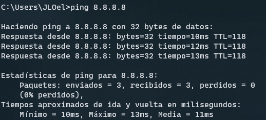
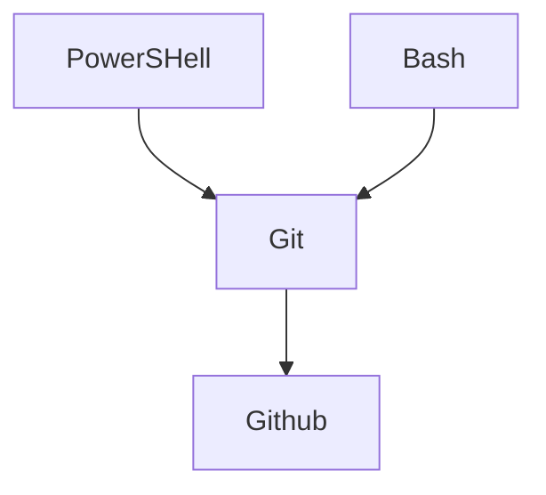

# PRIMER ECTS DE FUNDAMENTOS DE COMPUTADORES 💻

  
  

<h2>PowerShell VS Bash Linux y la importancia de Github y Git</h2>

<ol>
<li><a href="#PowerShell"><strong>PowerShell</strong></a></li>
<li><a href="#ComparativaBash"><strong>Comandos PowerShell vs Bash Linux</strong></a></li>
<li><a href="#Github"><strong>Git en Github</strong></a></li>
</ol>

<h3><u>PowerShell</u></h3>

1. <a href="#Introducción">___Introducción___</a>
2. <a href="#Comandos">___La línea de comandos___</a>
3. <a href="#Significado">___¿Qué es PowerShell?___</a>
4. <a href="#Consola">___Abrir la consola de PowerShell___</a>

<strong style="font-size: 18px">Introducción</strong>

> La interfaz de usuario es el medio que utilizamos para comunicarnos con el ordenador.

> Interfaz gráfica: GUI(Proporciona un entorno visual)

> Interfaz de línea de comandos:CLI(Command Line Interface, nos permite dar instrucciones por medio de una línea de texto)

**¿Cuál de las dos debemos utilizar?**

> La respuesta es fácil, depende de lo que queramos hacer, si quieres navegar, trabajar con un procesador de texto, hoja de cálculo, retocar fotografía, etc, tu respuesta es la interfaz gráfica.
> Y si lo que quieres es automatizar tareas, crear usuarios de forma masiva, comprobar conectividad con servidores pues la respuesta es PowerShell(La linea de comandos)

   

<strong style="font-size: 18px">La línea de comandos</strong>

Vamos a ver ahora cómo ha evolucionado la línea de comandos de Windows

*CMD o símbolo del sistema*
Todavía convive con nosotros pero cada vez se utiliza menos, tal vez para hacer un ping o ipconfig

*PowerShell*

Automatizar tareas.
Orientada a Objetos.
Lenguaje de Script.
Windows PowerShell ISE

Entorno para ejecutar, escribir, probar y depurar scripts.

<strong style="font-size: 18px">¿Qué es PowerShell?</strong>

<strong>Abrir la consola de PowerShell</strong>

La PowerShell es una herramienta multiplataforma utilizada principalmente por los administradores de Sistemas Windows para automatizar tareas y tener un mayor control del sistema.
Esta herramienta está formada por una shell de comandos, un lenguaje de scripting y un marco de administración de configuración.

***¿Dónde podemos encontrar PowerShell?*** En Windows 10 la encontramos, Windows Server, Microsoft Azure, SQL Server, Sercivios de Office 365, se encuentra prácticamente en todos los productos de Microsoft

***¿Qué requisitos se necesitan para aprender dicha herramienta?***
Como se trata de un curso a nivel de iniciación en PowerShell, cualquier persona con conocimientos de informática a nivel de usuario podría hacerlo sin mayor problema, ahora bien hay una parte en la que se habla de variables y estructuras condicionales y entonces aquí si se requiere conocimientos mínimos de programación

***¿Qué máquina necesitamos para trabajar en PowerShell?***
Es suficiente con tener un Windows 10 instalado o bien un Windows Server
¿Qué contenidos vamos a ver?

**Vamos a ver:**

<ul>
<li><a href="#Comandos">La línea de comandos de Windows</a></li>
<li><a href="#Ayuda">La ayuda en PowerShell</a></li>
<li><a href="#Archivos">Gestión de archivos y carpetas</a></li>
<li><a href="#Tuberias">Tuberías y redireccionamiento</a></li>
<li><a href="#Scripts">Iniciación a los scripts</a></li>
<li><a href="#F1">Fundamentos de scripts-I: Variables</a></li>
<li><a href="F2">Fundamentos de scripts-II: Estructuras de control y funciones</a></li>
</ul>

> Este curso está planteado en lo más práctico posible. Las Prácticas que vamos a realizar son las siguientes:
>
>> ___En el primer momento empezaremos a trabajar con la PowerShell y la PowerShell ISE(que es el entorn)___
>>
>
>> ___Vamos a buscar Información___
>>
>
>> ___Vamos a utilizar los comandos básicos relacionados con la gestión de archivos y carpetas___
>>
>
>> ___Vamos a enlazar la salida de un comando con la entrada de otro y redireccionar la salida___
>>
>
>> ___Y Vamos a realizar pequeños scripts y hablando de Scrips, vamos a hacer un script en el que combinaremos esctructuras condicionales, repetitivas y redireccionamiento.___
>>

***¿Qué vamos a conseguir al finalizar este curso?***

Pues vamos a:

<table>
<tr>
<th><strong>A manejar tanto la PowerShell como la PowerShell ISE con soltura.</strong></th>
<th><strong>Buscar información en la ayuda de PowerShell.</strong></th>
<th><strong>Conocer los comandos básicos.</strong></th>
<th><strong>Ser capaces de realizar scripts para automatizar determinadas tareas.</strong></th>
</tr>
</table>

<h3>PowerShell vs Bash Linux</h3>

Lorem ipsum dolor sit amet, consectetur adipisicing elit. Aliquid dolores incidunt placeat tempore. Aliquid aspernatur commodi dicta earum facilis minima nam, neque obcaecati provident quisquam unde vero! Atque aut distinctio ducimus exercitationem fuga illo odio praesentium quaerat quasi tempore. Ab, beatae blanditiis, consectetur consequatur dignissimos eaque error eum fugiat harum nulla quam quisquam quod, sunt vitae?

<h3>Git en Github</h3>

Lorem ipsum dolor sit amet, consectetur adipisicing elit. Eaque esse harum modi omnis veritatis. Accusantium, architecto, aspernatur assumenda blanditiis commodi cum cumque cupiditate dignissimos dolore enim facere fugit harum incidunt maiores maxime minima modi natus nostrum nulla numquam, quasi ratione repellat sint totam velit voluptas voluptate voluptates! Ab asperiores at cupiditate dicta dolore dolorem dolores dolorum ea, eaque earum, error est hic, illum ipsa magni maxime minus nesciunt nostrum odit officia quae quam quas quidem quis quo reprehenderit tempora tempore. Animi corporis ea eligendi hic mollitia, nulla!

