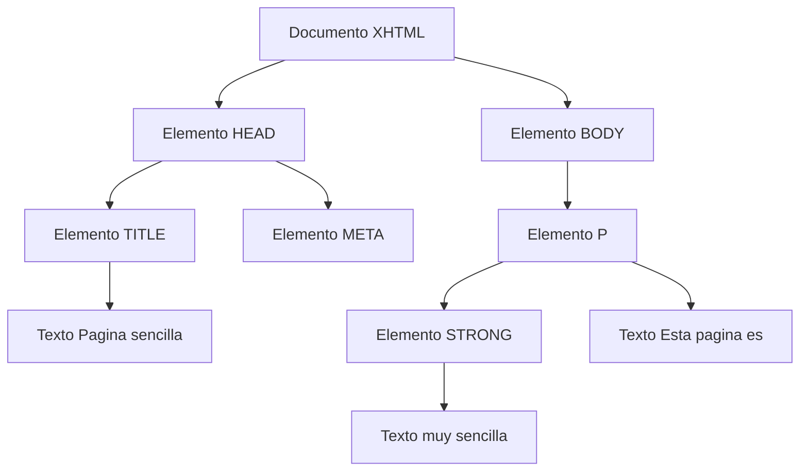

```mermaid
graph TD
A[Documento XHTML]-->B[Elemento HEAD]
B-->H[Elemento TITLE]
B-->I[Elemento META]
H-->J[Texto Pagina sencilla]
A-->C[Elemento BODY]
C-->D[Elemento P]
D-->E[Elemento STRONG]
D-->F[Texto Esta pagina es]
E-->G[Texto muy sencilla]


```