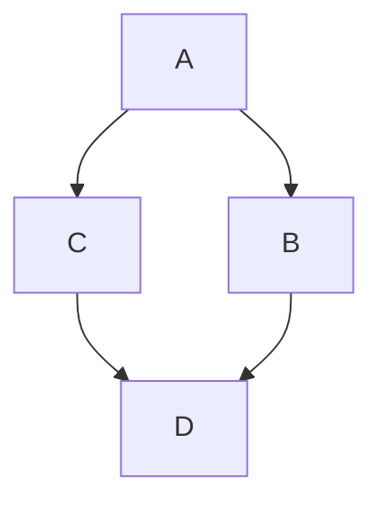

[](https://github.com/hamzamohdzubair/redant)
[](https://hamzamohdzubair.github.io/redant/)
[](https://docs.rs/crate/redant/latest)
[](https://crates.io/crates/redant)
[](https://lib.rs/crates/redant)

# Mostrar Colores

-  `#f03c15`
-  `#c5f015`
-  `#1589F0`

# Para usar colores en texto

```diff
- text in red
+ text in green
! text in orange
# text in gray
@@ text in purple (and bold)@@
```

# Diagramas



# Trofeos

[](https://github.com/ryo-ma/github-profile-trophy)

# Uso de Badge icons

- code coverage percentage: 
- status of third-party dependencies: 
- [PowerShell](https://semver.org/) version observance: 
- amount of [Liberapay](https://liberapay.com/) donations per week: 
- Python package downloads: 
- Chrome Web Store extension rating: 
- [Uptime Robot](https://uptimerobot.com) percentage: 
  <br>
  %20(ESC)
  %2F(/)
  %25(%)
  <br>


[](https://microsoft.com/windows/)
[](https://github.com)
[](https://git-scm.com)

# Mi progreso en Github

[](https://github.com/anuraghazra/github-readme-stats)

# Los lenguajes utilizados

[](https://github.com/anuraghazra/github-readme-stats)

# Mis contribuciones en Gitb¡hub

[](https://github.com/DenverCoder1/github-readme-streak-stats)

